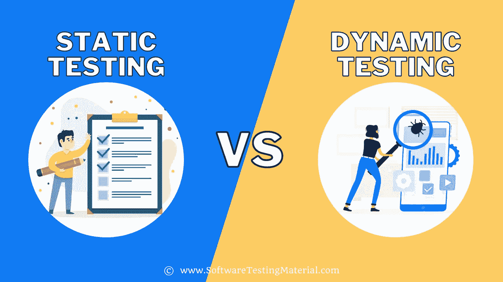

# 静态测试与动态测试|有什么区别

> 原文:[https://www . software testing material . com/static-testing-vs-dynamic-testing/](https://www.softwaretestingmaterial.com/static-testing-vs-dynamic-testing/)

在本教程中，我们将详细学习静态测试和动态测试。

Table of Contents <button class="kb-table-of-contents-icon-trigger kb-table-of-contents-toggle" aria-expanded="true" aria-label="Collapse Table of Contents">*   [什么是静态测试？](#h-what-is-static-testing)
*   [什么是动态测试？](#what-is-dynamic-testing)
*   [静态测试和动态测试有什么区别？](#what-is-the-difference-between-static-and-dynamic-testing)</button> 

## **什么是静态测试？**

**静态测试**是一种[软件测试](https://www.softwaretestingmaterial.com/software-testing/)方法，用于在不实际执行软件应用程序代码的情况下检查软件中的缺陷。

阅读我们关于[静态测试](https://www.softwaretestingmaterial.com/static-testing/)的详细指南

## **什么是动态测试？**

**动态测试**是一种软件测试方法，通过执行软件应用的代码来检查软件中的缺陷。

| 静态测试 | 动态试验 |
| --- | --- |
| 静态测试也称为验证测试。 | 动态测试也称为验证测试。 |
| 它是在不执行源代码的情况下完成的。 | 这是通过执行源代码来完成的。 |
| 它防止了缺陷。 | 它会找到并修复缺陷。 |
| 它包括清单和要遵循的流程。 | 它涉及源代码和执行的测试用例。 |
| 它包括评审、走查、检查等。, | 它包括功能性、非功能性测试和数据/控制流分析。 |
| 与动态测试相比，有很多会议。 | 与静态测试相比，会议次数更少。 |
| 它比动态测试便宜。 | 它比静态测试更昂贵。 |
| 一般需要的时间比较少。 | 完成这个过程需要更长的时间，因为它涉及到执行几个测试用例。 |
| 它在 SDLC 的早期阶段执行。 | 它在 SDLC 的后期执行。 |
| 它在代码部署之前执行。 | 它在代码部署之后执行。 |
| 它涵盖了结构和语句覆盖测试。 | 它涵盖了代码的可执行文件。 |
| 它包括需求文档、设计文档、程序规范等。, | 它包括单元测试、集成测试、系统测试、性能测试、安全测试等。, |
| 一些用于静态测试的工具有:
-check style
-Clang
-Eclipse
-Sonarqube
-Soot
-源表 | 一些用于动态测试的工具有:
-bounds checker
-droid box
-Diakon
-proc mon
-ValGrind |

**相关帖子:**

*   [SDLC Vs STLC](https://www.softwaretestingmaterial.com/sdlc-vs-stlc/)
*   [质量保证与质量控制(QA 与 QC)](https://www.softwaretestingmaterial.com/quality-assurance-vs-quality-control/)
*   [手动与自动化测试](https://www.softwaretestingmaterial.com/manual-testing-vs-automation-testing/)
*   [黑盒和白盒测试](https://www.softwaretestingmaterial.com/black-box-and-white-box-testing/)
*   [冒烟测试与健全性测试](https://www.softwaretestingmaterial.com/smoke-testing-vs-sanity-testing/)
*   [测试策略与测试计划](https://www.softwaretestingmaterial.com/test-strategy-vs-test-plan/)
*   [测试用例与测试场景](https://www.softwaretestingmaterial.com/test-scenario-vs-test-case/)
*   [回归 Vs 重测](https://www.softwaretestingmaterial.com/difference-between-regression-and-retesting/)
*   [严重性与优先级](https://www.softwaretestingmaterial.com/what-is-the-difference-between-severity-and-priority-in-software-testing/)
*   [功能与非功能测试](https://www.softwaretestingmaterial.com/performance-testing-tutorial/#Difference-between-Functional-Testing-and-Nonfunctional-Testing)
*   [单元测试与集成测试](https://www.softwaretestingmaterial.com/unit-testing/#Difference-between-Unit-Testing-&-Integration-Testing)
*   [集成 Vs 系统测试](https://www.softwaretestingmaterial.com/integration-testing/#What-is-the-difference-between-Integration-Testing-and-System-Testing)
*   [验证和确认](https://www.softwaretestingmaterial.com/verification-and-validation/)
*   [进入和退出标准](https://www.softwaretestingmaterial.com/entry-and-exit-criteria/)
*   [性能工程与性能测试](https://www.softwaretestingmaterial.com/performance-testing-tutorial/#Difference-between-Performance-Engineering-And-Performance-Testing)
*   [性能与负载测试](https://www.softwaretestingmaterial.com/performance-testing-tutorial/#Difference-between-Performance-Testing-Load-Testing-And-Stress-Testing)
*   [负载测试与压力测试](https://www.softwaretestingmaterial.com/load-testing-tutorial/#difference-between-load-testing--stress-testing-load-testing-vs-stress-testing)
*   [桌面、客户端-服务器和 Web 应用程序测试的区别](https://www.softwaretestingmaterial.com/difference-between-desktop-client-server-and-web-application-testing/)
*   [缺陷 Bug 错误和失败的区别](https://www.softwaretestingmaterial.com/difference-between-defect-bug-error-and-failure/)