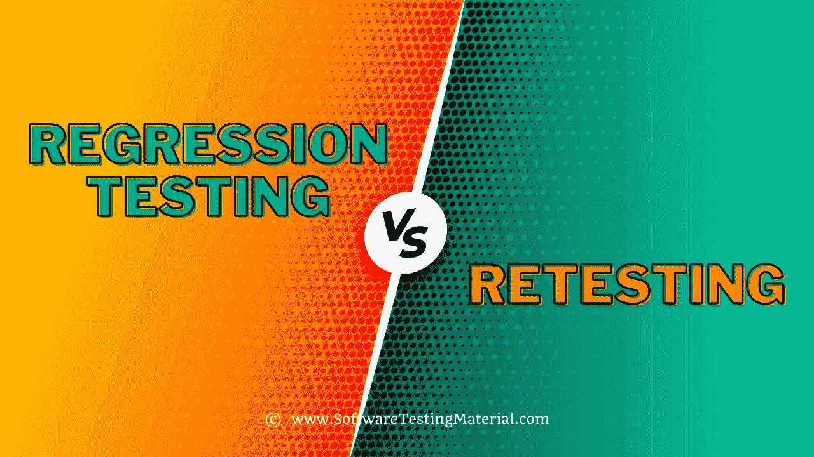

# 回归和重测的区别是什么

> 原文:[https://www . software testing material . com/difference-between-regression-and-retest/](https://www.softwaretestingmaterial.com/difference-between-regression-and-retesting/)

我们来看看回归和重测的**区别。这可能是大一新生五大[软件测试面试问题之一](https://www.softwaretestingmaterial.com/100-software-testing-interview-questions/)。**

大多数测试人员对回归和重测感到困惑。

在本帖中，我们将展示回归和重测之间的区别，并用实际例子来清楚地理解。

请耐心等待。视频将在一段时间后加载。

如果你喜欢这个视频，那么请订阅我们的 YouTube 频道以获得更多的视频教程。

## **回归测试:**

修改后对已测试的程序进行重复测试，以发现由于被测软件或其他相关或不相关软件组件的变化而引入或发现的任何缺陷。

通常，我们在以下情况下进行回归测试:

1.  应用程序中增加了新的功能
2.  变更需求(在组织中，我们称之为 CR)
3.  缺陷修复
4.  性能问题修复
5.  环境变化(例如..将数据库从 MySQL 更新到 Oracle)

## **重新测试:**

确保在早期构建中发现和发布的缺陷在当前构建中得到修复或没有修复。

比方说，Build 1.0 发布了。测试团队发现了一些缺陷(缺陷 Id 1.0.1，1.0.2)并发布。

Build 1.1 发布了，现在测试这个 Build 中的缺陷 1.0.1 和 1.0.2 正在重新测试。

### **展示回归和重测之间差异的示例:**

我们来看两个场景。

案例 1:登录页面——登录按钮不起作用(错误)

案例 2:登录页面–增加了“保持登录”复选框(新功能)

在案例 1 中，登录按钮不起作用，所以测试人员报告了一个错误。一旦 bug 被修复，测试人员会对其进行测试，以确保登录按钮是否按照预期的结果工作。

之前我已经在“ [Bug 报告模板](https://www.softwaretestingmaterial.com/bug-report-template/)”上发布了一个详细的帖子。如果你没有浏览过，可以点击这里浏览。另外，你可以从这里下载[样例错误报告模板/缺陷报告模板](https://www.softwaretestingmaterial.com/bug-report-template/sample-bug-report-template/)。

在案例 2 中，测试人员测试新特性，以确保新特性(保持登录)是否按预期工作。

案例 1 属于**重新测试**。在这里，tester 通过使用错误报告中提到的重现步骤，重新测试在早期版本中发现的错误。

同样在案例 1 中，tester 测试了与登录按钮相关的其他功能，我们称之为**回归测试。**

案例 2 属于**回归测试。**在这里，tester 测试新特性(保持登录)并测试相关功能。在测试新特性的同时测试相关功能属于**回归测试。**

### **再比如:**

想象一下，测试中的应用程序有三个模块，即管理、采购和财务。财务模块依赖于采购模块。如果一个测试人员在购买模块上发现了一个错误并发布。一旦 bug 被修复，测试人员需要进行**重测**来验证与采购相关的 bug 是否被修复，测试人员还需要进行**回归测试**来测试依赖于采购模块的财务模块。

### **回归和重测的其他一些区别:**

对失败的测试用例进行重新测试，而对通过的测试用例进行回归测试。

重新测试确保最初的缺陷已经被纠正，而回归测试确保没有意外的副作用。

## **重测 vs 回归测试**

下面是一个详细的对比示例

| 回归测试 | 再检查 |
| --- | --- |
| 执行回归测试是为了确保代码更改不会影响现有功能。 | 执行重新测试是为了确保在缺陷被修复后，先前失败的测试用例被通过。 |
| 进行回归测试是为了验证在新代码更改的基础上是否有任何现有功能受到影响。 | 在缺陷修复的基础上进行重新测试。 |
| 缺陷验证不属于回归测试。 | 缺陷验证属于重新测试。 |
| 回归测试的优先级低于重新测试。回归测试与再测试同时进行。 | 重测的优先级高于回归测试。在回归测试之前进行重新测试。 |
| 我们可以自动化回归测试用例。手动回归测试更加昂贵和耗时。 | 由于不确定性，我们不能自动化测试用例进行重新测试。 |
| 回归测试是一种通用测试。 | 重新测试是有计划的测试。 |
| 我们对通过的测试用例进行回归测试。 | 我们只对失败的测试案例进行重新测试。 |
| 回归测试验证了意想不到的副作用。 | 重新测试验证原始缺陷是否已经修复。 |
| 回归测试用例来源于功能规范。 | 先前失败的测试用例被用于重新测试。 |

**相关帖子:**

*   [什么是复试？当我们在软件开发中进行重新测试时。](https://www.softwaretestingmaterial.com/retesting/)
*   [回归测试|如何执行，类型，技术，工具](https://www.softwaretestingmaterial.com/regression-testing/)
*   [2020 年最佳回归测试工具|软件测试材料](https://www.softwaretestingmaterial.com/regression-testing-tools/)
*   我们真的为所有测试类型编写了测试用例吗
*   [自动化测试教程|软件测试材料](https://www.softwaretestingmaterial.com/automation-testing-tutorial/)