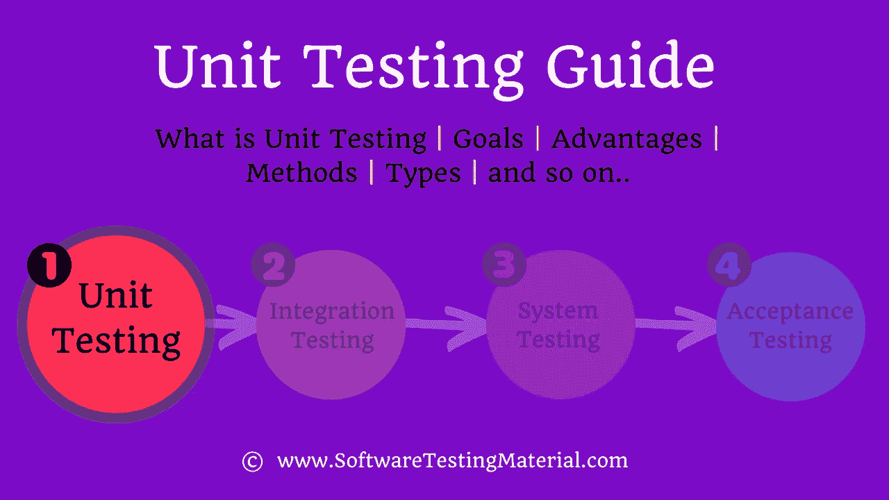

# 单元测试指南|软件测试材料

> 原文:[https://www . software Testing material . com/Unit-Testing/# Difference-between-Unit-Testing-&-Integration-Testing](https://www.softwaretestingmaterial.com/unit-testing/#Difference-between-Unit-Testing-&-Integration-Testing)

单元测试是软件测试中的第一级测试，测试软件的各个组件。如果你是软件测试新手，一定要阅读这篇[软件测试初学者指南](https://www.softwaretestingmaterial.com/unit-testing/)。也不要错过我们的 [100 多种软件测试](https://www.softwaretestingmaterial.com/types-of-software-testing/)的详细列表。

让我们详细探讨一下什么是单元测试。

在本文中，我们将看到以下内容:

单元测试也称为模块测试或组件测试。它是在应用程序开发期间完成的，用于检查应用程序的单个单元或模块是否正常工作。它是由开发者在开发者的环境中完成的。

## **软件测试的级别:**

软件测试有四个级别。每个级别的软件测试都验证软件功能的正确性、质量和性能。软件测试的四个级别如下:

1.  单元测试
2.  集成测试
3.  系统试验
4.  验收测试

## **单元测试的区别&集成测试:**

| 单元测试 | 集成测试 |
| --- | --- |
| 单元测试是软件测试中的第一级测试 | 集成测试是软件测试中的第二级测试 |
| 将每个组件视为一个单一系统 | 集成组件被视为单个系统 |
| 目的是测试单个装置的工作情况 | 目的是测试多个单元模块的集成 |
| 它评估了软件产品的每个组件或单元 | 它检查模块集成后以及外部接口和系统的正常工作、接口和可靠性 |
| 单元测试的范围仅限于被测试的特定单元 | 与单元测试相比，单元测试的范围更广。它涵盖了两个或更多模块 |
| 它没有进一步的类型 | 分为以下几种方法
自下而上的整合方法
自上而下的整合方法
大爆炸方法
混合方法
 |
| 它也被称为组件测试 | 它也被称为 I&T 或字符串测试 |
| 它是在代码级别执行的 | 它是在通信级别执行的 |
| 它是在可重用测试用例的帮助下完成的 | 它是在存根和驱动程序的帮助下完成的 |
| 它接受白盒测试 | 它包括黑盒测试和白盒测试 |
| 它是由开发人员执行的 | 它由测试人员或开发人员执行 |

## **单元测试的目标:**

单元测试的目标是

*   隔离代码的每一部分。
*   以确保每个部分都是正确的。
*   在开发周期的早期发现 bug。
*   节约测试成本。
*   允许开发人员在以后重构或升级代码。

## **单元测试的优势:**

*   它在开发周期的早期发现问题。所以降低了测试成本。较早发现 bug 的成本比较晚发现它的成本要低得多。
*   它减少了改变现有功能时的缺陷([回归测试](https://www.softwaretestingmaterial.com/regression-testing/)
*   它简化了调试过程。调试是发现并解决程序中妨碍软件正确运行的缺陷的过程。当实现单元测试时，当测试失败时，只需要调试代码中的最新更改。
*   由于更好的编码标准和实践，它提供了代码文档

## **单元测试方法:**

它是通过使用白盒测试方法来执行的。

## **单元测试的类型:**

单元测试有两种类型——*手动* & *自动*。

## **进行单元测试时:**

单元测试是软件测试的第一级。它在集成测试之前执行。

## 谁执行单元测试:

它通常由软件开发人员或白盒测试人员执行。

## **单元测试的任务是什么:**

**单元测试计划:**

*   准备
*   回顾
*   修订
*   基线

**单元测试用例/脚本:**

*   准备
*   回顾
*   修订
*   基线

**单元测试:**

*   完成

## **单元测试工具:**

有几个自动化工具可以帮助单元测试。我们将在下面提供几个例子:

6 月:t1]

*JUnit 5* 是 JUnit 的下一代。目标是为 JVM 上的开发人员端测试创建一个最新的基础。这包括关注 Java 8 和更高版本，以及支持许多不同风格的测试。

努涅特:

NUnit 是一个面向所有人的单元测试框架。网络语言。最初是从 JUnit 移植过来的，当前的产品版本 3 已经完全重写，增加了许多新特性，并支持广泛的。NET 平台。

**JMockit: **

JMockit 是开源的单元测试工具。JMockit 是一个用于开发人员测试的 Java 工具包，包括模拟 API 和代码覆盖工具。

**艾玛:**

EMMA 是一个用于测量和报告 Java 代码覆盖率的开源工具包。EMMA 通过追求一个独特的特性组合而与其他工具区分开来:支持大规模企业软件开发，同时保持单个开发人员的工作快速和迭代。*你团队中的每个开发人员*现在都可以免费获得代码覆盖率*，而且他们可以快速获得*！**

**phpunit:**

**PHPUnit 是一个面向程序员的 PHP 测试框架。它是用于单元测试框架的 xUnit 架构的一个实例。**

*   **[2020 年最佳单元测试工具](https://www.softwaretestingmaterial.com/unit-testing-tools/)**
*   **[2020 年最佳功能测试工具](https://www.softwaretestingmaterial.com/functional-testing-tools/)**

**在这里，我精心挑选了几个帖子，可以帮助你了解更多与面试相关的东西:**

*   **[集成测试](https://www.softwaretestingmaterial.com/integration-testing/)**
*   **[硒教程](https://www.softwaretestingmaterial.com/selenium-tutorial/)**
*   **[手动测试教程](https://www.softwaretestingmaterial.com/manual-testing-tutorial/)**
*   **[软件测试人员 SQL 教程](https://www.softwaretestingmaterial.com/sql-tutorial-complete/)**
*   **[性能测试教程](https://www.softwaretestingmaterial.com/performance-testing-tutorial/)**
*   **[安全测试教程](https://www.softwaretestingmaterial.com/security-testing-tutorial/)**
*   **[API 测试教程](https://www.softwaretestingmaterial.com/api-testing/)**