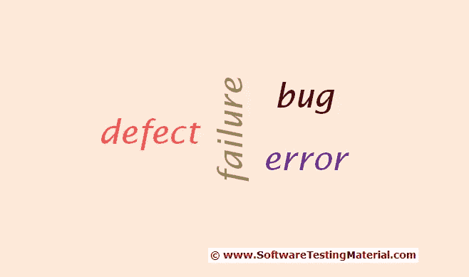

# 缺陷、错误、错误和失败的区别

> 原文:[https://www . software testing material . com/difference-between-defect-bug-error-and-failure/](https://www.softwaretestingmaterial.com/difference-between-defect-bug-error-and-failure/)

让我们看看缺陷、bug、错误和失败的区别。一般来说，每当系统/应用程序运行异常时，我们都会使用这些术语。有时我们称之为错误，有时称之为 bug 等等。很多软件测试行业的新手在使用这个的时候都有困惑。

缺陷、错误、失误和失败之间的区别是招聘新人时的一个面试问题。

一般来说，这些术语的用法是矛盾的。通常在[软件开发生命周期](/sdlc-software-development-life-cycle/)中，我们根据阶段使用这些术语。

[https://www.youtube.com/embed/53braDId-RQ](https://www.youtube.com/embed/53braDId-RQ)

## 什么是缺陷？

实际结果和预期结果之间的差异被称为缺陷。

如果开发人员发现了一个问题，并在开发阶段自己纠正了它，那么它就被称为缺陷。

## 什么是 bug？

如果测试人员在测试阶段发现应用程序/系统中的任何不匹配，那么他们称之为 Bug。

前面提到过，Bug 和 Defect 的用法是有矛盾的。人们普遍认为 bug 是缺陷的非正式名称。

## 什么是错误？

由于程序中的编码错误，我们无法编译或运行程序。如果一个开发者不能成功地编译或运行一个程序，他们称之为**错误**。

## **什么是失败？**

一旦产品被部署，客户发现任何问题，他们就称该产品为失败产品。发布后，如果最终用户发现一个问题，则该特定问题被称为**故障**

需要了解的要点:

如果质量分析师(QA)发现了一个 bug，他必须使用 bug 报告模板重现并记录它。

之前我已经在“ [Bug 报告模板](https://www.softwaretestingmaterial.com/bug-report-template/)”上发布了一个详细的帖子。如果你没有浏览过，可以点击这里浏览。

此外，您可以从这里下载[样例错误报告模板/缺陷报告模板](https://www.softwaretestingmaterial.com/bug-report-template/sample-bug-report-template/)。

记得把这篇文章分享给任何可能从这篇文章中受益的人，包括你在脸书的朋友、Twitter 粉丝、LinkedIn 粉丝和你的 Google+群组成员！