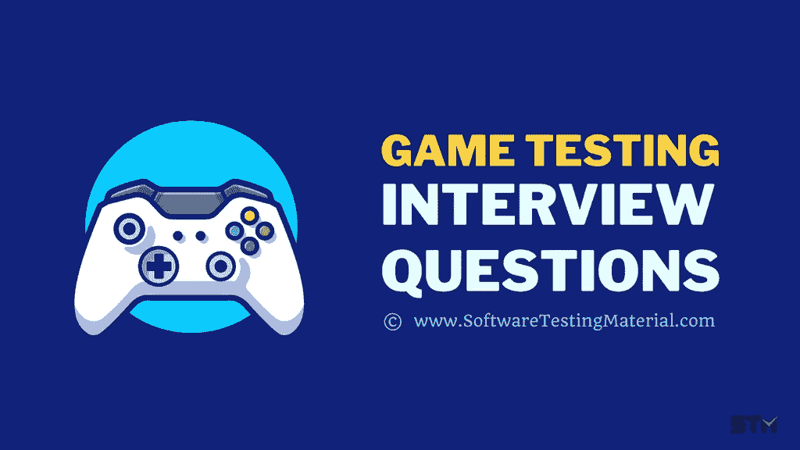

# 2022 年 20+游戏测试面试问答

> 原文:[https://www . software testing material . com/game-testing-interview-questions/](https://www.softwaretestingmaterial.com/game-testing-interview-questions/)

在游戏测试面试中，你应该展示你对游戏心理学的理解，对游戏设计的深入了解，以及你的沟通技巧。你必须向他们展示你的决心和耐心，因为他们希望你长时间集中精力工作。

你必须向你的雇主展示你对游戏的热情，所以你应该非常了解游戏行业，它的趋势，历史，游戏机等等。面试官最有可能问你三种类型的问题，基本背景问题，基于测试的问题，游戏知识。

> ***不要错过:**游戏测试详细指南&如何成为游戏测试员*

## **电子游戏测试员面试问题&答案**

这里有几个问题可以帮助你通过游戏测试面试。有几个问题你必须用你的个人经验来回答。对于这种情况，有一个示例答案。

### **1。你如何测试一个游戏？**

**回答:**我会测试多个场景，找出小故障和错误，向开发团队报告这些问题，然后重新测试这些场景。这将是我的责任，以验证游戏的设计是否如预期，并验证游戏的性能

### **3。关于做游戏测试员最大的神话是什么？**

**回答:**游戏测试人员的角色和职责与 QA 测试人员相同。关于游戏测试员的一个最大的误区是，我们玩游戏是有报酬的。实际上，我们编写测试用例，提交 bug 报告，与不同的涉众交流，就像任何 QA 一样。

### **4。解释测试任何游戏的过程？**

**回答:**我们要从看故事板、架构、了解游戏的特点、人物、难度等级等来了解游戏概念开始。然后，我们必须遵循以下步骤。

*   收集需求
*   创建测试策略
*   准备测试用例
*   执行
*   审查和报告

### **5。游戏行业中使用的测试技术有哪些类型？**

**回答:**我们可以用不同类型的测试来测试一个游戏。根据行业标准，我们使用功能测试、组合测试、净室测试、树测试、游戏测试、兼容性测试、性能测试等。

### **6。你将如何确保游戏没有错误？你会使用哪些不同的策略？**

**回答:**为了确保游戏应用程序没有错误，我们可以遵循一些策略来帮助我发现关键的错误。

*   我会在各种条件下重复玩几个关卡，试图打破游戏。
*   我会根据游戏的适应性，在不同的设备上测试游戏，比如游戏机、电脑和手机。
*   我会在游戏中尝试不同的设置和选择，看看它的表现如何。
*   我会分析游戏的新版本，并重新测试现有的错误。

### 7 .**。你在游戏测试员的职业生涯中遇到过哪些挑战？**

在这里，你可以解释你在以前的工作场所面临的问题。

**示例答案:**我面临的一些常见挑战包括

*   不同利益相关者之间缺乏沟通
*   要验证游戏中的每个设施几乎是不可能的。
*   每个游戏应用程序都是独一无二的，所以没有一个明确的指南可供我们参考来测试一个游戏。

### **8。你为什么想从事电子游戏行业？**

在这里你可以和面试官分享你的个人经历。

**样本回答:**游戏总是让我着迷。我会玩上几个小时。我甚至记得在玩的时候截图报了一个 bug，甚至在我小的时候。我一直想知道他们怎么没有注意到这么严重的错误。考上大学后，我迷上了编码，迷上了游戏行业。我想 10 岁的我会为自己选择的职业感到骄傲。

### **9。你最喜欢的电子游戏是什么？**

面试官想知道你对游戏的热情，因为这份工作需要你反复玩游戏。他们需要知道你是否喜欢这项活动。

**样本回答:**即使我和朋友一起花数小时玩在线互动游戏。我一直最喜欢的是马里奥，它的音乐、色彩或世界构建让它变得有趣、迷人和令人上瘾。

### 10。视频游戏开发者通常会忽略什么？

在这里你必须展示你对游戏不同方面的理解。

**样本答案:**

从发展的角度来看，我见过几个故事情节很棒的游戏，但随着游戏升级到不同的级别，角色失去了意义，或者角色变得多余。

**从测试的角度来看，**我遇到了很多 bug。当角色靠近墙壁或进入游戏中无法继续前进的死胡同时，会出现故障，等等。

### **11。如果用户发现你开发的一款游戏有很多 bug，你会怎么做？**

在这里你要向面试官展示你解决问题的技巧。

**示例回答:**我会尽可能多地收集关于他们的信息，如重现问题的步骤、先决条件、截图、视频日志等。创建一个清晰的 bug 报告，并将其分配给修复它的人。然后与不同的利益相关者就这些问题进行沟通。

### **12。你有什么方法可以改进你正在玩的游戏吗？**

面试官可能会给你一个游戏让你玩，然后问这个问题。在这里，你可以展示你作为游戏玩家、批判性思考者的专业知识，或者你在游戏心理学方面的知识。

**示例回答:**我会努力改善音质，即音乐和音频质量，即语音聊天。放置一个放大和缩小的摄像机角度，以获得更好的清晰度。

### 13。你为什么想在这里工作？

在这里，你必须展示你的技能和激情是如何让组织受益的。

**样本回答:**我把这个机会看作是为游戏行业做贡献的一种方式，我觉得以我多年的用户经验，我可以做到。我觉得我的技能特别适合这个职位，因为它需要批判性思维、关注细节和极大的耐心。

### **14。评估视频游戏质量的最佳方式是什么？**

**回答:**我们可以用几个因素来评估游戏的质量，例如

*   注册、下载和安装电子游戏容易吗？
*   用户界面是多么方便、一致和灵活。(控制、难度等。)
*   导航应该是不言自明的——菜单项、操作键配置、帮助和其他选项。
*   游戏的“故事”有多好？(演示/背景)
*   你玩得有多开心(视觉展示，动画，背景物体，主要物体，框架。)
*   他们实现了他们想做的事情了吗？(人物与环境的互动设计)
*   游戏的整体可玩性
*   背景音乐和音效。
*   摄像机视图、放大、缩小功能。
*   电池消耗
*   像多人游戏功能，保存级别/分数
*   游戏的安全性——是否有入侵者的潜在威胁。

### 15。成功的电子游戏测试员需要具备哪些技能？

**回答:**要成为一名优秀的视频游戏测试员，你应该具备出色的解决问题的能力，对游戏行业有良好的了解，了解质量保证流程，能够在短时间内完成工作，注意细节，并对重复性工作有耐心。

### 16。玩游戏时，你会用什么技术来发现所有的错误和故障？

**回答:**游戏中找出 bug 有不同的方法。其中一些是

*   探索性测试
*   不遵守游戏规则
*   按错误的顺序演奏
*   到处尝试不同的功能
*   不同的策略，如最小/最大输入

### **17。你认为测试电子游戏最困难的方面是什么？**

在这里，你可以解释你在之前的工作中测试时遇到的障碍。

**样本回答:**我们在测试游戏设计、架构、节奏、功能、逻辑、游戏性、UX、平衡等等的时候，要考虑很多东西。再加上时间紧迫，这是一个充满挑战的过程。

### 18。你对之前测试过的游戏有什么推荐？

它显示了你希望在游戏中提供什么类型的最终用户体验，以及你以前的工作经验。

**样本回答:**我给了几个提高游戏可用性的建议。以增强颜色来获得更好的可视性和其他可能在玩游戏时使用户沮丧的特征。

### **19。你有没有发现你玩的游戏有什么小毛病？说出平台和发生的部分？**

在这里，面试官想知道你对细节的关注和批判性思维能力。越具体越好。

**示例答案:**我在《部落冲突》中观察到，当我试图向我的朋友捐赠部队时，我面临网络错误，否则他们不会接收。我甚至尝试用带 WiFi 和移动网络的 iOS 手机和笔记本电脑重现这个问题。它注意到不同的结果。

### 20。你最喜欢的流派是什么？

在这里你可以表达你的兴趣，让面试官知道你对游戏的热情。

**示例回答:**当我开始玩游戏时，我曾经玩过很多射击游戏，现在的体育类游戏，我看到自己在玩叙事幻想类型的游戏，因为有大量的世界构建和冒险情节。

**相关帖子:**

*   [完整游戏测试指南](https://www.softwaretestingmaterial.com/how-to-become-a-game-tester/)
*   [如何成为一名游戏测试员](https://www.softwaretestingmaterial.com/how-to-become-a-game-tester/)
*   [如何成为一名软件测试员](https://www.softwaretestingmaterial.com/how-to-become-a-software-tester/)
*   你为什么选择软件测试作为职业？
*   [从手工测试到自动化测试的职业转变](https://www.softwaretestingmaterial.com/career-shift-from-manual-to-automation-testing/)
*   [公司众包测试指南&测试人员](https://www.softwaretestingmaterial.com/crowdsourced-testing-guide/)
*   [2022 年 15+最佳 Windows 10 视频播放器 Windows PC 媒体播放器](https://www.softwaretestingmaterial.com/video-player-windows/)
*   [2022 年 10+最佳 Mac 视频播放器 Mac OS 媒体播放器](https://www.softwaretestingmaterial.com/video-player-mac/)
*   [2022 年 Windows PC 最佳安卓模拟器& Mac(免费和付费)](https://www.softwaretestingmaterial.com/android-emulators/)
*   [带示例的 Git 初学者教程](https://www.softwaretestingmaterial.com/git-tutorial/)