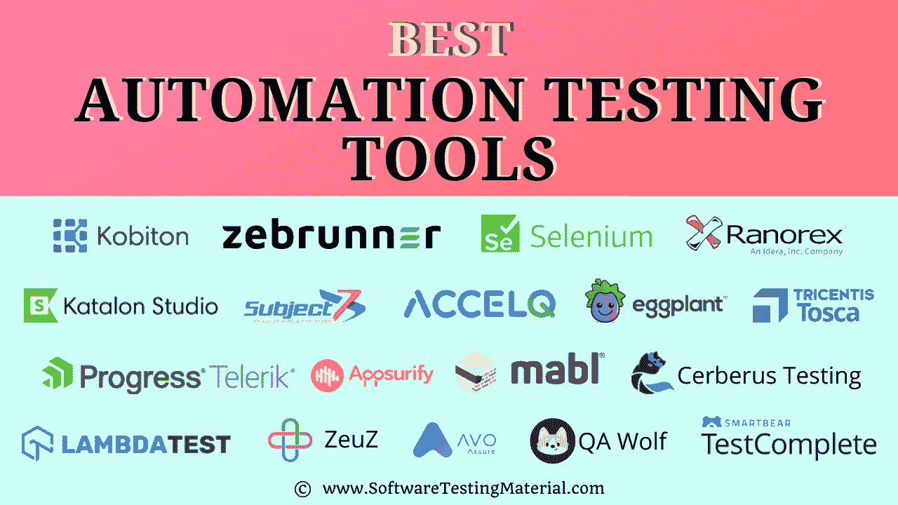

# 最佳自动化测试工具(免费和付费)| 2022 年 8 月

> 原文:[https://www . software testing material . com/best-automation-testing-tools-2018/](https://www.softwaretestingmaterial.com/best-automation-testing-tools-2018/)

您是否正在寻找 2022 年最好的自动化测试工具，并且不知道如何选择测试自动化工具？

在本文中，我们精心挑选了最好的测试自动化工具来测试您的应用程序。

Table of Contents <button class="kb-table-of-contents-icon-trigger kb-table-of-contents-toggle" aria-expanded="true" aria-label="Collapse Table of Contents">*   什么是自动化测试？
*   [最流行的自动化工具对照表](#most-popular-automation-tools-comparision-table)
*   [流行的测试自动化工具列表](#list-of-popular-test-automation-tools)
    *   [1 .Kobiton](#1-kobiton)
    *   2 . zebrunner
    *   [3 号。严格〔t1〕](#3-testrigor)
    *   [4 号。加泰罗尼亚工作室〔t1〕](#4-katalon-studio)
    *   [#5。硒](#5-selenium)
    *   [#6。主题 7](#6-subject7)
    *   [#7。UFT 一号](#7-uft-one)
    *   [#8\. Ranorex](#8-ranorex)
    *   [#9。LambdaTest](#9-lambdatest)
    *   [10。test complete〔t1〕](#10-testcomplete)
    *   [#11。茄子](#11-eggplant)
    *   [12。咳咳咳咳咳咳咳咳咳咳咳咳咳咳咳咳咳咳咳咳咳咳咳咳咳咳咳咳咳咳咳咳咳咳咳咳咳咳咳咳咳咳咳咳咳咳咳咳咳咳咳咳咳咳咳咳咳咳咳咳咳咳咳咳咳](#12-tricentis-tosca)
    *   [#13。ZeuZ 测试自动化框架](#13-zeuz-test-automation-framework)
    *   [14。加速度〔t1〕](#14-accelq)
    *   [#15。Avo 保证](#15-avo-assure)
    *   [#16。地狱犬测试](#16-cerberus-testing)
    *   [17。Mabel〔t1〕](#17-mabl)
    *   [18。QA Wolf](#18-qa-wolf)
    *   [#19。机器人框架](#19-robot-framework)
    *   [20。watir〔t1〕](#20-watir)
    *   [#21。Appsurify TestBrain](#21-appsurify-testbrain)
    *   [22 号。电视测试工作室〔t1〕](#22-telerik-test-studio)
    *   [#23。IBM Rational Functional Tester](#23-ibm-rational-functional-tester)
    *   [#24。21 个实验室](#2421-labs)
    *   [25。平衡〔t1〕](#25-qualibrate)
*   [常见问题——自动化应用测试工具](#faqs--automated-application-testing-tools)
    *   [什么是测试自动化工具？](#what-are-test-automation-tool)
    *   [如何选择最好的测试自动化工具？](#how-to-select-the-best-test-automation-tool)
    *   有多少自动化测试工具可用？
    *   最好的自动化测试工具是什么？
    *   [为什么选择正确的自动化工具很重要？](#why-choosing-the-correct-automation-tool-is-important)
*   [总之](#in-conclusion)</button> 

Market TrendsAs per Markets and Markets, the global automation testing market size is estimated to be valued at USD 20.7 billion in 2021 to USD 49.9 billion by 2026, at a CAGR of 18.0% over the forecast period (2021-2026).

<figcaption>**Source:** [Markets and Markets](https://www.marketsandmarkets.com/Market-Reports/automation-testing-market-113583451.html)</figcaption>

## 什么是自动化测试？

自动化测试是使用自动化工具测试软件以发现[缺陷](https://www.softwaretestingmaterial.com/bug-life-cycle/)的过程。在这个过程中，执行测试脚本和生成结果是由自动化工具自动执行的。一些最流行的自动化测试工具有惠普 QTP/UFT、[、Selenium WebDriver](https://www.softwaretestingmaterial.com/install-selenium-webdriver/) 等。,

阅读这篇全面的[自动化测试教程](https://www.softwaretestingmaterial.com/automation-testing-tutorial/)。

### **什么是测试自动化工具？**

测试自动化工具是一种能够在很少或没有人工干预的情况下执行所需软件测试任务的软件。

市场上有各种各样的测试自动化软件，这些工具在许多方面有所不同，有些如下

1。他们测试的应用——如网络、桌面和移动
2。许可——开源，商业
3。记录和回放功能，它们支持的脚本和编程语言

在当今的软件开发世界中，质量、客户满意度、生产率等开发实践都在随着时间的推移而变化，以处理完美的服务、发布最好的产品并缩短交付时间。软件测试和自动化工具在实现这些目标的过程中扮演着关键角色。

你可以查看我们全面的[指南来选择一个自动化测试工具](https://www.softwaretestingmaterial.com/guide-to-select-automation-testing-tools/)。它帮助你如何选择一个自动化测试工具，在这篇文章中，我们将列出最流行的自动化测试工具。

### **如何选择最好的测试自动化工具？**

问自己以下问题，以选择最佳的 QA 自动化工具。

1。你会自动化哪些测试？
2。您的团队拥有使用自动化工具所需的技能吗？
3。你需要多少预算来获得一个新的自动化工具？
4。您希望从任何工具中获得什么样的特性？
5。你在寻找什么样的集成能力？
6。脚本复用和维护的难度有多大？

入围两到三个工具，做一个试点，敲定最好的一个。最后，与风险承担者讨论所选择的工具，并获得批准以进行自动化。

### 有多少自动化测试工具可用？

市场上有许多可用的工具(开源的和商业的)。在本文中，我们列出了最好的自动化工具以及每个工具的特性。

### 最好的自动化测试工具是什么？

一些最好的测试自动化工具如下

#1。科比顿
排名第二。Zebrunner
#3。测试严格性
#4。卡塔龙工作室
#5。硒
#6。主题 7
#7。UFT 一号
#8。Ranorex
#9。LambdaTest
#10。测试完成

### **为什么选择正确的自动化工具很重要？**

自动化是任何业务的重要组成部分，选择正确的自动化工具至关重要。您选择的自动化工具将决定您的自动化过程的效率，以及它与您现有系统的集成程度。在选择自动化工具时，有几件事情需要考虑:-易用性、功能性、平台兼容性、集成、价格等。，

通过花时间考虑所有这些因素，您可以确保选择适合您业务的自动化工具。从长远来看，这样做会节省您的时间和金钱，并使您的自动化过程更加高效。

## **总之**

除了上面提到的工具，市场上还有很多其他的自动化测试工具，它们针对不同类型的测试..这里提到的自动化测试工具列表是一些流行的 QA 自动化工具。每一个工具都有其独特的特性来应对软件自动化的挑战。

如果我们错过了你最喜欢的工具，请在下面评论。我们也将对它们进行审查，并将其纳入此列表。

在这里，我精心挑选了一些帖子，它们将帮助你学习更多关于软件测试的知识。

*   [最佳 Bug 跟踪工具](https://www.softwaretestingmaterial.com/popular-defect-tracking-tools/)
*   [最佳 API 测试工具](https://www.softwaretestingmaterial.com/best-api-testing-tools/)
*   [流行的测试管理工具](https://www.softwaretestingmaterial.com/test-management-tools/)
*   [测试策略文档-完整指南](https://www.softwaretestingmaterial.com/test-strategy/)
*   [如何准备测试计划](https://www.softwaretestingmaterial.com/test-plan-template/)
*   [带有详细解释的测试用例模板](https://www.softwaretestingmaterial.com/test-case-template-with-explanation/)
*   [解释测试自动化框架](https://www.softwaretestingmaterial.com/explain-test-automation-framework/)
*   [你为什么选择软件测试作为职业](https://www.softwaretestingmaterial.com/choose-software-testing-as-a-career/)
*   [手动测试教程](https://www.softwaretestingmaterial.com/manual-testing-tutorial/)
*   [硒教程](https://www.softwaretestingmaterial.com/selenium-tutorial/)

如果您还有任何问题，请随时通过评论提问。如果你觉得这篇文章有用，请在社交网络上与你的朋友分享。

*免责声明:工具的顺序不代表任何建议。您可以根据自己的需求选择任何工具。*

**关于作者:**

Katalon Studio 是一个简单而强大的自动化解决方案，由 KMS 技术公司为各地的测试人员打造。该工具提供了与流行的商业解决方案相当的特性，同时消除了从开源构建自动化框架的工作。最重要的是，我们致力于保持 Katalon 工作室免费。

**更新:**以上帖子最近由 STM 管理员修改。