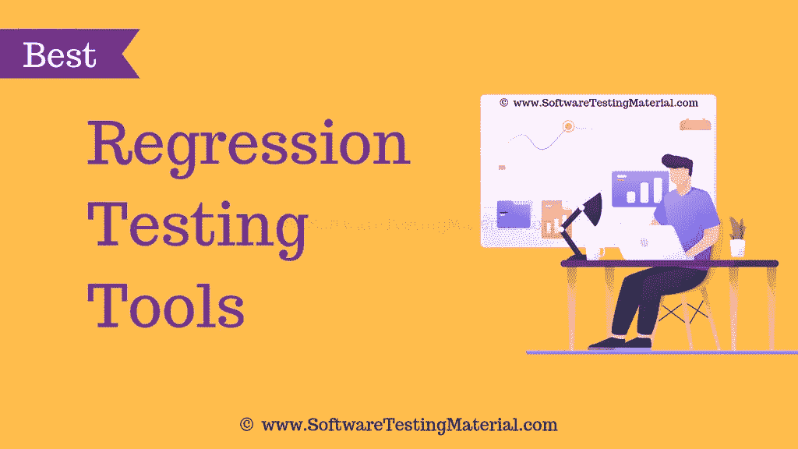

# 2022 年最佳回归测试工具(免费和付费)

> 原文:[https://www . software testing material . com/regression-testing-tools/](https://www.softwaretestingmaterial.com/regression-testing-tools/)

在这篇文章中，我将列出一些自动化回归测试的最佳回归测试工具。

它包含付费和开源的免费回归测试工具。这些工具保证了回归测试用例的顺利运行，节省了测试执行的大量时间。

*   [What is regression testing?](#h-what-is-regression-testing)
*   [The most popular functional regression testing tool](#h-most-popular-functional-regression-testing-tools)
    *   第一名.测试精度
    *   [# 2。 Selenium](#h-2-selenium)
    *   [#3。Ranorex 工作室](#h-3-ranorex-studio)
    *   [#4。 Water](#h-4-watir)
    *   [5 号。sahi pro〔t1〕](#h-5-sahi-pro)
    *   [#6。 Complete test](#h-6-testcomplete)
    *   第七名.IBM Rational Functional Tester
    *   [# 8。 Test](#h-8-silk-test)
    *   [[9th]. Tranquility](#h-9-serenity)
    *   [#10。 Test master](#h-10-testingwhiz)
    *   [#11。 Wizard QA](#h-11-qa-wizard)
*   [Other top regression testing tools](#h-other-top-regression-test-tools)
    *   第十二名.时移 x
    *   [# 13。 Test drive](#h-13-testdrive)
    *   第十四课.AdventNet QE 引擎
    *   15 . httest
    *   [#16。 Display](#h-16-screenster)
*   [Conclusion](#h-conclusion)

## 什么是回归测试？

修改后对已测试的程序进行重复测试，以发现由于被测软件或其他相关或不相关软件组件的变化而引入或发现的任何缺陷。

简而言之，我们通过对修改后的应用程序重新执行测试来进行回归测试，以评估修改后的代码是否破坏了之前工作的任何东西。每当我们修改应用程序时，我们都应该进行回归测试(我们运行回归测试)。

1.  测试严格性
2.  Selenium
3.  Ranorex Studio
4.  沃特沃特 Walter
5.  萨尼普罗
6.  测试完成
7.  IBM Rational 功能测试器
8.  丝绸测试
9.  宁静
10.  测试高手
11.  问答向导
12.  时移
13.  试车
14.  AdventNet QEngine
15.  httest(httest)
16.  筛选员

### **1 .严格〔t1〕**

testRigor 是一个无代码的 UI 自动化工具，被认为是回归测试的绝佳选择。作为一个云托管的人工智能解决方案，它使整个团队能够用简单的英语创建、编辑和维护测试。

**特性:**

*   跨浏览器和跨平台
*   人工智能驱动的简单流畅的命令语法
*   与 Selenium 相比，测试用例创建速度快 15 倍
*   与 Selenium 相比，测试维护减少高达 95%
*   稳定可靠的测试
*   轻松集成到 CI 渠道中
*   涵盖网络和移动浏览器、原生移动应用和 API
*   测试是从最终用户的角度构建的。不需要 XPaths 或 CSS 选择器
*   每个测试步骤的详细截图和分析

**免费试用:**14 天免费试用

[testRigor](https://www.softwaretestingmaterial.com/go/testrigor-regression-testing-tool/)

### **#2。Selenium**

Selenium 是一个开源(免费)的自动化测试套件，用于测试 web 应用程序。它是用于 web 应用程序测试的顶级自动化回归测试工具之一。它支持不同的平台和浏览器。在基于 web 的自动化测试方面，它已经获得了很大的声望。Selenium 是一套不同的软件工具。每个工具都有不同的方法来支持基于 web 的自动化测试。

它有四个组成部分，

*   Selenium IDE (Selenium 集成开发环境)
*   Selenium 遥控
*   Selenium WebDriver
*   Selenium 栅

**定价:**免费(开源)

[Selenium](http://www.seleniumhq.org/)

### **#3\. Ranorex Studio**

Ranorex Studio 是一个强大的自动化工具，可以加速桌面、移动和 web 的回归测试。全球超过 4，000 家公司受益于 Ranorex Studio，效率提高了 78%。回归测试可以在晚上运行，并行运行或者分布在 Selenium 网格上。

Ranorex Studio 提供了无代码测试自动化以及完整的开发环境和 API，这确保了该工具易于初学者使用，但提供了专家所需的功能。希望提高回归测试可管理性的用户可以从强大的对象识别、可共享的对象存储库和对数据驱动测试的支持等特性中受益。该工具生成易于阅读的测试报告，这些报告完全可定制，包括屏幕截图、详细的错误日志和视频捕获。

该工具允许集成到一个完整的测试工具链中。从 CI 服务器触发回归测试，在缺陷跟踪系统中报告缺陷，用源代码控制管理自动化测试，等等。

**免费试用:**30 天免费试用

[Ranorex](https://www.ranorex.com/regression-testing-tool/?utm_source=softwaretestingmaterial&utm_medium=cpc&utm_campaign=regression-testing-tools)

### **4 .watir〔t1〕**

Watir 代表 Ruby 中的 Web 应用程序测试。这是一个用于自动化测试的开源 Ruby 库。Watir 与浏览器的交互方式和人们一样:点击链接、填写表格和验证文本。它是一个开源回归测试工具。它可以用来自动化回归测试套件。

*   这是一个免费的开源工具。
*   重量轻且易于使用的工具
*   它支持不同平台上的多种浏览器。
*   跨平台操作系统支持
*   技术独立

**定价:**免费(开源)

[Watir](http://watir.github.io/)

### **5 号。sahi pro〔t1〕**

Sahi Pro 有助于 web 应用程序的自动化功能测试。默认情况下，Sahi Pro 支持 web 应用程序和 REST API 自动化。Sahi Pro 非常适合对包含大量 AJAX 和动态内容的复杂 web 2.0 应用程序进行跨浏览器/多浏览器测试。Sahi Pro 可以在任何支持 javascript 的现代浏览器上运行。它支持您测试 web 浏览器、桌面和移动应用程序。它是一个以测试人员为中心的自动化回归测试工具。

*   内置 Excel 框架，让您的业务分析师和非技术专业人员参与测试。
*   简单而强大的 API
*   目标间谍和记录者
*   自动记录和报告
*   并行和分布式回放
*   连续累计
*   在任何操作系统上测试任何浏览器
*   测试任何 Windows 桌面应用程序
*   测试任何 iOS 和 Android、本地和混合应用程序

**免费试用:** 30 天

**定价:**每年 695 美元起

[SahiPro](http://sahipro.com/)

### **6 号。test complete〔t1〕**

TestComplete 允许您创建和维护跨 web、移动和桌面应用程序的自动化回归测试。它将使您能够在一个浏览器中快速创建自动化 GUI 测试，并在 1，500 个远程测试环境中并行运行它们，包括浏览器、操作系统、分辨率和设备，从而帮助您确保完整的测试覆盖范围并提高软件质量。

TestComplete 是一个自动化的 UI 测试工具，允许您创建、维护和执行跨桌面、移动和 web 应用程序的功能测试

*   在 1500 个真实测试环境中并行运行测试
*   容易为多种浏览器创建一个自动化的 GUI 测试
*   它支持桌面、网络和移动应用。
*   数据驱动测试
*   关键词驱动测试
*   自动化测试报告和分析

**免费试用:** 30 天

**定价:**每用户 8400 美元(包括桌面、移动&网络)

[TestComplete](https://smartbear.com/product/testcomplete/)

### **#7。IBM Rational Functional Tester**

IBM RFT 是一个数据驱动的测试平台，用于功能和回归测试。它支持广泛的应用，例如。Net、Java、SAP、Flex 和 Ajax。RFT 使用 Visual Basic。Net 和 Java 作为脚本语言。RFT 有一个独特的功能，叫做故事板测试，用户在 AUT 上的操作被记录下来，并通过应用程序截图以故事板的格式可视化。

RFT 的另一个有趣的特性是它与 IBM Jazz 应用程序生命周期管理系统的集成，比如 IBM Rational Team Concert 和 Rational Quality Manager。

**免费试用:**可用

**许可:**商业

[Rational Functional Tester](https://www.ibm.com/in-en/marketplace/rational-functional-tester/purchase)

### **#8。丝绸测试**

企业软件应用的自动化功能和回归测试。您可以使用 Silk Test 对所有移动应用程序类型进行回归、跨平台和本地化测试，包括移动 web、移动本地和混合应用程序

**免费试用:** 45 天

[Silk Test](https://www.microfocus.com/products/silk-portfolio/silk-test/)

### **#9。宁静号**

Serenity BDD 是一个开源库，可以帮助您更快地编写更高质量的自动化回归和验收测试。

*   编写更加灵活和易于维护的测试
*   为你的测试制作图文并茂的叙述性报告
*   将您的自动化测试映射回您的需求
*   查看实际测试了多少应用程序
*   并跟踪项目进展

**定价:**开源

[Serenity](http://www.thucydides.info/#/)

### **10。test gwhiz**

TestingWhiz 是一个回归测试自动化工具。它允许您通过在持续集成中重新运行自动化测试来自动化软件、web、数据库、移动设备、web 服务和 API 的回归测试。

*   Web 应用程序测试
*   移动应用测试
*   云应用测试
*   QoQ 验证
*   性能诊断

**免费试用:** 30 天

[TestingWhiz](https://www.testing-whiz.com/)

### **#11。问答向导**

QA Wizard Pro 自动化 web、Windows 和 Java 应用程序的功能和回归测试，并对 web 应用程序进行负载测试。

**源代码:**许可

[Perforce](https://www.perforce.com/tutorial-videos/course/qa-wizard-pro-basics)

## **其他顶级回归测试工具**

### **#12。TimeShiftX**

**官网:** [链接](https://www.vornexinc.com/)

### **#13。试驾**

**官网:** [链接](http://origsoft.com/products/testdrive/)

### **#14。AdventNet QE engine**

**官网:** [链接](https://www.manageengine.com/products/qengine/qengine-eol.html)

### 15 . httest

**官网:** [链接](https://sourceforge.net/projects/htt/)

### **#16 .屏保**

**官网:** [链接](http://www.creamtec.com/products/screenster/index.html)

## **结论**

我们尽力列出了流行的回归测试工具(开源的和商业的都有)。在上面提到的所有回归测试工具中，根据您的需求选择最佳回归测试工具完全取决于您的需求和预算。在下面的评论中让我们知道你最喜欢的回归测试工具。如果你觉得我忘了提到你最喜欢的工具，请联系我们。

如果你想深入了解我们的最新帖子，那就去看看我们的[主页](https://www.softwaretestingmaterial.com/)。

喜欢这个帖子？别忘了分享一下！

免责声明:这些回归测试工具的顺序并不代表任何建议。

下面是几篇精选的文章供你接下来阅读:

*   [缺陷跟踪工具](https://www.softwaretestingmaterial.com/popular-defect-tracking-tools/)
*   [测试管理工具](https://www.softwaretestingmaterial.com/test-management-tools/)
*   [自动化测试工具](https://www.softwaretestingmaterial.com/best-automation-testing-tools-2018/)
*   [性能测试工具](https://www.softwaretestingmaterial.com/performance-testing-tools/)
*   [渗透测试工具](https://www.softwaretestingmaterial.com/penetration-testing-tools/)
*   [开源安全测试工具](https://www.softwaretestingmaterial.com/open-source-security-testing-tools/)
*   [API 测试工具](https://www.softwaretestingmaterial.com/best-api-testing-tools/)
*   [跨浏览器测试工具](https://www.softwaretestingmaterial.com/best-cross-browser-testing-tools/)