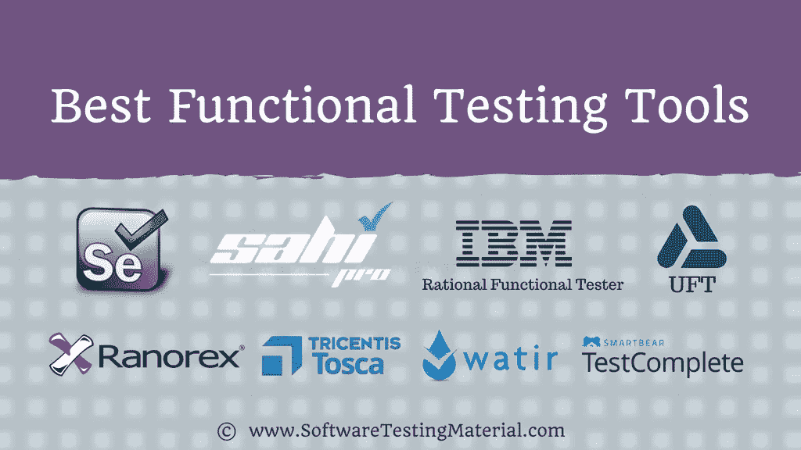

# 2022 年最佳功能测试工具(免费和付费)

> 原文:[https://www . software testing material . com/functional-testing-tools/](https://www.softwaretestingmaterial.com/functional-testing-tools/)

在本帖中，我们将看到 2022 年最好的功能测试工具。

软件开发实践随着时间而变化，工具和技术也是如此。这些变革旨在提高生产率、质量和客户满意度，解决交货时间越来越短的问题，并提供成功的产品和服务。软件测试显然在实现这些目标的过程中扮演着重要的角色。

这篇文章总结了顶级功能测试工具，这些工具有可能帮助组织最好地定位自己，以跟上软件测试的趋势。该列表包括开源和商业功能测试解决方案。

## **流行的功能测试工具**

让我们看看一些流行的功能测试工具。

Selenium 支持多种系统环境(Windows、Mac、Linux)和浏览器(Chrome、Firefox、IE 和 Headless 浏览器)。它的脚本可以用各种编程语言编写，比如 Java、Groovy、Python、C#、PHP、Ruby 和 Perl。虽然测试人员可以灵活地使用 Selenium，并且他们可以编写复杂和高级的测试脚本来满足各种级别的复杂性，但是它需要高级的编程技能和努力来为特定的测试需求构建自动化框架和库。

许可:开源

[Try Selenium](http://www.seleniumhq.org/)

### **2 .test complete〔t1〕**

SmartBear 的 TestComplete 是一个强大的商业测试工具，用于 web、移动和桌面测试。TestComplete 支持各种脚本语言，如 JavaScript、VBScript、Python 和 c++脚本。像 Katalon Studio 一样，测试人员可以使用 TestComplete 执行关键字驱动和数据驱动的测试。该工具还提供了易于使用的记录和回放功能。

TestComplete 的 GUI 对象识别功能可以自动检测和更新 UI 对象，这有助于在 AUT 发生变化时减少维护测试脚本的工作量。它还在 CI 流程中与 Jenkins 集成。

**许可:**商业

[Try TestComplete](https://smartbear.com/)

### **#3\. Ranorex**

Ranorex Studio 是一款适用于桌面、移动和 web 的一体化测试自动化工具，受到全球 4000 多家公司的信赖。该应用程序提供了无代码的测试自动化，使初学者能够直接进行测试，以及一个完整的 IDE，为专家提供他们需要的功能。

**特性:**

*   可靠的对象识别，即使是具有动态 id 的 web 元素。
*   可共享对象存储库。
*   使用可重用的代码模块减少测试维护。
*   跨平台和跨浏览器测试。
*   使用内置的 Selenium WebDriver 在 Selenium 网格上并行测试或分布测试。
*   可定制、易于阅读的测试报告。
*   启用视频报告来查看导致测试失败的原因，而无需重新运行测试。
*   集成了完整的测试工具链:Azure DevOps、吉拉、Jenkins、TestRail、Git 等等。

[Try Ranorex](https://www.ranorex.com/)

### **4 .watir〔t1〕**

Watir 是一个基于 Ruby 库的 web 自动化测试的开源测试工具。Watir 支持[跨浏览器测试](https://www.softwaretestingmaterial.com/what-is-cross-browser-testing/)包括 Firefox、Opera、headless browser 和 IE。它还支持数据驱动的测试，并与 RSpec、Cucumber 和 Test/Unit 等 BBD 工具集成。

许可:开源

[Try Watir](http://watir.com/)

### **#5。IBM Rational Functional Tester**

IBM RFT 是一个数据驱动的测试平台，用于功能和回归测试。它支持广泛的应用，例如。Net、Java、SAP、Flex 和 Ajax。RFT 使用 Visual Basic。Net 和 Java 作为脚本语言。RFT 有一个独特的功能，叫做故事板测试，用户在 AUT 上的操作被记录下来，并通过应用程序截图以故事板的格式可视化。

RFT 的另一个有趣的特性是它与 IBM Jazz 应用程序生命周期管理系统的集成，比如 IBM Rational Team Concert 和 Rational Quality Manager。

**许可:**商业

[Try IBM Rational Functional Tester](https://www.ibm.com/)

### **6 号。咳咳咳咳咳咳咳咳咳咳咳咳咳咳咳咳咳咳咳咳咳咳咳咳咳咳咳咳咳咳咳咳咳咳咳咳咳咳咳咳咳咳咳咳咳咳咳咳咳咳咳咳咳咳咳咳咳咳咳咳咳咳咳咳咳**

Tricentis Tosca 是一个基于模型的测试自动化工具，为持续测试提供了相当广泛的功能集，包括仪表板、分析和集成，以支持敏捷和 DevOps 方法。

Tricentis Tosca 帮助用户优化测试资产的可重用性。像许多其他测试自动化工具一样，它支持广泛的技术和应用程序，比如 web、mobile 和 API。Tricentis Tosca 还具有集成管理、风险分析和分布式执行功能。

**许可:**商业

[Try Tricentis Tosca](https://www.tricentis.com/)

### **7 .空气〔t1〕**

统一功能测试(UFT)是一个众所周知的商业功能测试工具。它为跨平台的桌面、web 和移动应用程序的 API、web 服务和 GUI 测试提供了全面的功能集。该工具具有先进的基于图像的对象识别功能、可重用的测试组件和自动化文档。

UFT 使用 Visual Basic 脚本版本来注册测试过程和对象控制。UFT 与水星业务流程测试和水星质量中心相结合。该工具通过与 Jenkins 等 CI 工具集成来支持 CI。

**许可:**商业

[Try UFT](cus.com/fr-ca/software/uft)

### **8 .sahi pro〔t1〕**

Sahi Pro 有助于 web 应用程序的自动化功能测试。默认情况下，Sahi Pro 支持 web 应用程序和 REST API 自动化。Sahi Pro 非常适合对包含大量 AJAX 和动态内容的复杂 web 2.0 应用程序进行跨浏览器/多浏览器测试。Sahi Pro 可以在任何支持 javascript 的现代浏览器上运行。它支持您测试 web 浏览器、桌面和移动应用程序。它是一个以测试人员为中心的自动化回归测试工具。

*   内置 Excel 框架，让您的业务分析师和非技术专业人员参与测试。
*   简单而强大的 API
*   目标间谍和记录者
*   自动记录和报告
*   并行和分布式回放
*   连续累计
*   在任何操作系统上测试任何浏览器
*   测试任何 Windows 桌面应用程序
*   测试任何 iOS 和 Android、本地和混合应用程序

**免费试用:** 30 天

**定价:**每年 695 美元起

[Try Sahi Pro](http://sahipro.com/)

## **结论**

我们已经包括了我们遇到的大多数工具。如果我们遗漏了任何工具，请在评论中分享，我们会将它们包括在我们的功能测试工具列表中。你可能还想看看我们最终的测试管理工具列表，其中包含了[流行的测试管理工具](https://www.softwaretestingmaterial.com/test-management-tools/)。

如果你想深入了解我们的最新帖子，那就去看看我们的[主页](https://www.softwaretestingmaterial.com/)。

喜欢这个帖子？别忘了分享一下！

测试愉快！

免责声明:这些测试管理工具的顺序并不代表任何建议。

下面是几篇精选的文章供你接下来阅读:

*   [API 测试工具](https://www.softwaretestingmaterial.com/best-api-testing-tools/)
*   [服务虚拟化工具](https://www.softwaretestingmaterial.com/service-virtualization-tools/)
*   [单元测试工具](https://www.softwaretestingmaterial.com/unit-testing-tools/)
*   [Web 应用测试工具](https://www.softwaretestingmaterial.com/web-application-testing-tools/)
*   [测试管理工具](https://www.softwaretestingmaterial.com/test-management-tools/)
*   [缺陷跟踪工具](https://www.softwaretestingmaterial.com/popular-defect-tracking-tools/)
*   [跨浏览器测试工具](https://www.softwaretestingmaterial.com/best-cross-browser-testing-tools/)
*   [自动化测试工具](https://www.softwaretestingmaterial.com/best-automation-testing-tools-2018/)
*   [性能测试工具](https://www.softwaretestingmaterial.com/performance-testing-tools/)
*   [渗透测试工具](https://www.softwaretestingmaterial.com/penetration-testing-tools/)
*   [回归测试工具](https://www.softwaretestingmaterial.com/regression-testing-tools/)