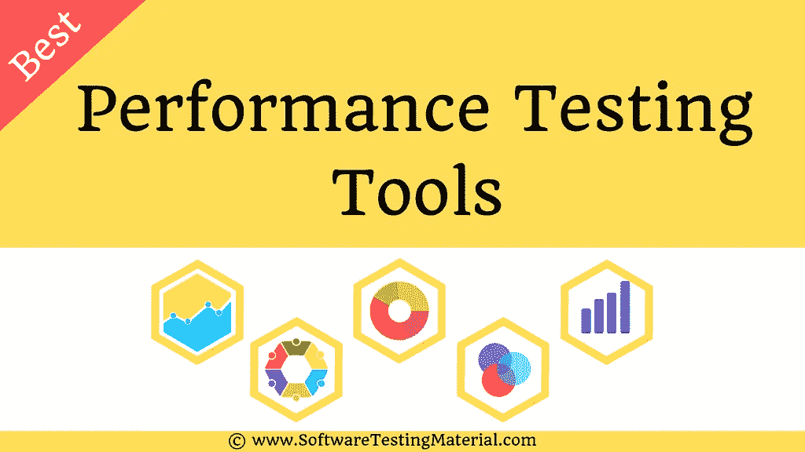

# 12 款最佳性能测试工具|负载测试工具(2022)

> 原文:[https://www . software testing material . com/performance-testing-tools/](https://www.softwaretestingmaterial.com/performance-testing-tools/)

你是否在寻找最好的**性能测试工具**却不知道从何入手？

在这篇文章中，我们列出了一些最流行的性能测试软件(又名负载测试工具)。

我们都知道很难想象没有互联网的今天。网站帮助我们与人联系，为网上购物提供商店，从世界任何地方随时带来新的故事。我们可以从任何电脑或移动设备访问这些网站。

在线业务要取得成功，就必须没有长时间的等待、延迟、错误或服务中断。

<button class="kb-table-of-contents-title-btn kb-table-of-contents-toggle" aria-expanded="false" aria-label="Expand Table of Contents">Table of Contents</button>

*   [什么是性能测试](#What-is-Performance-Testing)
*   [如何选择合适的性能测试工具](#How-to-choose-a-right-Performance-Testing-Tool)
*   [流行的性能测试工具(负载测试工具)](#Popular-Performance-Testing-Tools)
    *   1 .网络战
    *   [#2。LoadRunner(惠普性能测试仪)](#LoadRunner)
    *   [#3。阿帕奇 JMeter](#Apache-JMeter)
    *   4 .新负载
    *   [#5。压力刺激](#StresStimulus)
    *   [#6\. LoadUI Pro](#LoadUI-Pro)
    *   [#7。Rational 性能测试器](#Rational-Performance-Tester)
    *   [8 .施主〔t1〕](#AppLoader)
    *   [#9\. SmartMeter .我](#SmartMeter.io)
    *   [#10。丝绸表演者](#Silk-Performer)
    *   [#11。StormRunner 负载](#StormRunner-Load)
    *   [#12\. LoadView](#LoadView)
    *   [13 号。阿皮亚皮〔t1〕](#LoadView)
*   [其他一些性能测试工具如下:](#Some-other-Performance-Testing-Tools)
*   [结论](#conclusion)

## **什么是性能测试**

性能测试确定或验证被测系统或应用程序的速度、可伸缩性和/或稳定性特征。性能与实现满足项目或产品性能目标的响应时间、吞吐量和资源利用率水平有关。

性能测试和各种类型的性能测试，如负载测试、容量测试、压力测试、容量测试、浸泡/耐久性测试和峰值测试属于[非功能测试](https://www.softwaretestingmaterial.com/non-functional-testing/)。

阅读关于[性能测试](https://www.softwaretestingmaterial.com/performance-testing-types/)的更多信息

在当前的市场中，一个应用程序的性能起着至关重要的作用。我们进行性能测试来解决系统的瓶颈，并通过找到性能问题的根本原因来微调系统。性能测试回答了一些问题，如系统可以处理多少用户，当用户数量超过最大用户数量时，系统可以恢复得多好，系统在正常和峰值负载下的响应时间是多少。

我们使用性能测试工具来测量被测系统或应用(AUT)的性能，并帮助发布高质量的软件。

## **如何选择合适的性能测试工具**

市场上有很多工具可以进行性能测试。在所有可用的工具中，不可能提到最好的性能测试工具。是因为每个公司都有自己的需求。适合一家公司的不一定适合另一家公司。在选择合适的工具之前，我们必须做一些分析。以下是我们在选择最佳性能测试工具时必须考虑的一些因素。

选择最佳性能测试工具进行性能测试时需要考虑的一些因素。

*   预算(许可成本)
*   许可证类型
*   协议支持
*   负载测试工具的客户偏好
*   培训员工使用所选工具的成本
*   负载测试工具的硬件/软件要求
*   工具供应商支持和更新政策

## **流行的性能测试工具(负载测试工具)**

市场上有很多性能测试工具。有免费的网站负载测试工具，付费工具，免费增值工具。这里我们包括了开源性能测试工具和商业性能测试工具。几乎所有的商业性能测试工具都可以免费试用。在决定哪种工具最适合您的需求之前，您可以有机会亲自动手。

它在确保所发布软件的性能满足商定的 SLA(服务水平协议)方面起着至关重要的作用。

性能测试工具让您执行广泛的性能测试，并确保您的网站在业务蓬勃发展时不会变慢或崩溃。

几乎每个行业(如银行、电子商务、航空、零售、餐饮等)都存在性能问题。，)是共同面对的。

我们正试图为您提供一个全面的流行性能测试工具列表，用于测量 web 应用程序性能和负载压力能力。

### 1 .网络战

WebLOAD 是为 web 应用程序设计的企业级负载和性能测试工具。它支持从 web 协议到企业应用程序的一百多种技术，并内置了与 Jenkins、Selenium 和许多其他工具的集成，以实现对 DevOps 的连续负载测试。它将性能、可伸缩性和完整性结合为一个验证 web 和移动应用程序的流程。它可以模拟成千上万的并发用户，使测试大型负载和报告应用程序中的瓶颈、约束和弱点成为可能。测试结果是从负载机器上收集的，可以以表格或图形的形式实时查看。它与微软视窗和 Linux 等操作系统兼容。

**WebLOAD 特性:**

以下是 WebLOAD 的一些最重要的特性

*   WebLOAD 可以作为内部产品运行，也可以作为完全托管的 SaaS 负载测试解决方案运行。
*   一组预定义的分析报告提供性能数据，帮助用户识别瓶颈。还可以通过可定制的 Web 仪表板远程查看报告和分析数据。
*   它支持广泛的 web、移动和企业协议和技术。
*   强大的关联引擎可以识别服务器端和客户端的动态值。

**协议:**

WebLOAD 支持的协议和技术如下。

它支持广泛的 web、移动和企业协议和技术，如 HTTP/HTTPS、WebSocket、PUSH、AJAX、SOAP、HTML5、WebDAV 等。

[Try WebLoad](https://www.softwaretestingmaterial.com/go/webload/)

### **#2。LoadRunner(惠普性能测试器)**

LoadRunner 是 Micro Focus 的一款负载测试软件，用于应用程序负载测试。作为一种性能测试工具，它用于测试应用程序、测量系统行为和负载下的性能。它可以创建和处理成千上万的并发用户，使应用程序经受真实用户负载的考验，同时收集与性能相关的所需信息，并基于基础架构组件(Web 服务器、数据库服务器等)。).它报告业务流程和事务的最终用户响应时间，以便与服务级别协议(SLA)进行比较。然后可以对结果进行详细分析，以探究特定行为的原因。它与微软视窗和 Linux 等操作系统兼容。

**LoadRunner 特性:**

以下是 LoadRunner 的一些最重要的特性

*   它支持最新技术和遗留应用程序的性能测试。
*   使用高级网络行为和服务虚拟化支持基于浏览器和本机移动应用测试
*   将负载测试集成到您的开发工具中:IDE、jUnit、nUnit、Jenkins、Selenium 和 Microsoft Visual Studio
*   它通过使用集成的性能监视器实时识别性能瓶颈，这些监视器利用应用层和代码级数据进行根本原因分析

**协议:**

LoadRunner 支持的协议和技术如下。

LoadRunner 支持对 50 多种应用环境和协议进行性能测试，包括 Ajax、Flex、HTML 5、Microsoft Silverlight、HTTP/2、MQTT、Web、SOAP、ERP、Web 服务、GWT、RDP、数据库、终端、Citrix、Java 等。NET、Oracle 和 SAP。它支持最新的应用技术和传统技术。

[Try LoadRunner](https://www.microfocus.com/products/loadrunner-load-testing/free-trial)

### **#3。阿帕奇 JMeter**

Apache JMeter 应用程序是一个免费的开源负载测试工具。它是用 Java 写的。它最初是为测试 web 应用程序而设计的，但后来它的范围扩大了。它被设计为加载测试来分析和测量各种服务的性能。它可用于测试静态和动态资源(如动态 web 应用程序)的性能。模拟一台服务器、一组服务器、网络上的重负载，以查看应用程序在不同负载条件下的性能，这非常有用。它可以在 Linux、Windows 和 Mac OS X 上运行。

**Apache JMeter 特性:**

以下是 JMeter 的一些最重要的特性

*   这是一个免费的开源软件
*   它有一个简单直观的图形用户界面。
*   它是一个独立于平台的工具。它是用 Java 编写和开发的。它可以运行在任何接受 JVM (Java 虚拟机)的环境中。
*   它是高度可扩展的，支持不同的服务器类型。
*   其完整的多线程框架允许多个线程进行并发采样，并允许不同的线程组同时对不同的函数进行采样。
*   一个完整的，随时可以呈现的动态 HTML 报告
*   通过从最流行的响应格式(HTML、JSON、XML 或任何文本格式)中提取数据的能力，轻松实现关联
*   它支持多种协议

**协议&技术:**

JMeter 支持的协议如下。

*   web-http、HTTPS (Java、NodeJS、PHP、ASP)。净等。，，)
*   Web 服务–SOAP/REST
*   FTP 服务
*   通过 JDBC 驱动程序的数据库
*   LDAP 目录
*   邮件服务–SMTP、POP3、IMAP
*   通过 JMS 的面向消息的中间件(MOM)
*   本机命令或 shell 脚本
*   三氯苯酚
*   Java 对象

[Try JMeter](http://jmeter.apache.org/)

### 4 .新负载

NeoLoad 是一个强大的负载和性能测试软件解决方案，专为 web 和移动应用程序而设计。它模拟大量用户并分析服务器行为。它可以识别性能瓶颈，并提供一个解决方案来优化应用程序的设计和开发，以免它们成为生产中代价高昂的问题。它允许用户快速、高效、频繁地进行负载测试。这意味着无论采用何种技术，您都可以放心地部署高性能互联网、内部网或移动应用。它甚至支持最新的技术，如 Flex、Silverlight、GWT、SPDY、JSON 和 AJAX Push。它与持续交付平台相集成。它与 Microsoft Windows、Linux 和 Solaris 等操作系统兼容。

**NeoLoad 特性:**

以下是 NeoLoad 的一些最重要的功能

*   它支持 HTML5、Push、WebSocket、AngularJS、Oracle Forms 等最新技术
*   无脚本设计和可视化编程
*   与持续集成服务器的集成。它为 Jenkins、TeamCity、Bamboo 和 XebiaLabs XL 版本提供了现成的 CI 插件。
*   原生 GIT 支持
*   它集成了 Selenium、Appium、Perfecto MobileCloud 等功能测试工具。,

**协议:**

NeoLoad 支持的协议和技术如下。

SAP GUI Web、HTTP、HTTPS、WebSocket、SOAP、REST、Silverlight、Java 序列化、Java 消息服务、GWT、AJAX、Oracle Forms、Push 技术等。,

[Try NeoLoad](https://www.neotys.com/neoload/overview)

### **#5。压力刺激**

StresStimulus 是一个用于 web 应用程序、移动应用程序和企业应用程序的负载测试工具。它决定了应用程序在高流量负载下的 web 性能和可伸缩性。它收集实时服务器监控信息，以查明应用程序性能瓶颈并隔离 web 速度问题。它支持本地应用框架，节省了移动应用负载测试的时间。它记录用户动作并重放它们，以便模拟不同的使用模式。它还监控负载对应用程序响应能力和服务器基础设施的影响。它会自动修复播放错误。它有免费版和商业版。在免费试用中，您可以获得 7 天的可扩展试用，最多支持 10k 个虚拟用户和完全支持。

**应激刺激特征:**

以下是压力刺激的一些最重要的特征

*   它可以在内部使用，也可以从云中使用。
*   不管有没有提琴手都行。Fiddler 帮助创建、分析和调试 HTTP 流量。
*   脚本不是必需的，但是可以使用。我们可以通过一个 GUI 和基于向导的界面创建整个测试用例，而不需要接触脚本。
*   支持多种安全身份验证方法，包括 Web Forms、Basic、NTLM 和 Kerberos。
*   它支持外部数据(CSV 文件)的参数化
*   它提供深度报道。它生成一个测试摘要报告，提供关键性能指标。

**协议:**

StresStimulus 支持的协议和技术如下。

HTTP、HTTPS、AJAX、SOAP、WCF、二进制 WCF 和 HTTP 上的 XML。

[Try StressStimulus](https://www.stresstimulus.com/)

### **#6\. LoadUI Pro**

Smartbear 的 LoadUI Pro 是一个针对 REST & SOAP APIs、数据库和微服务的负载测试工具。它可以在 Windows、Linux 和 Mac OS 上运行。它允许用户在最短的时间内创建无脚本和复杂的负载测试。它允许用户测试 API 的速度和可伸缩性，在将它们发布到生产环境之前预览 API 性能行为，并将性能洞察转移到左边。用户可以访问详细的报告，并在 Bamboo、Jenkins、TFS 和其他自动化框架上自动进行负载测试。此外，SoapUI 功能测试可以使用 LoadUI Pro 快速转换为负载测试，而无需编写任何脚本。

**LoadUI Pro 特性:**

以下是 LoadUI Pro 的一些最重要的功能

*   基于云的 API 负载测试
*   无脚本负载测试创建
*   重用现有的功能测试，而不修改原始测试
*   并行 API 负载测试
*   服务器监控让您了解服务器如何响应流量

**协议:**

LoadUI Pro 支持的协议和技术如下

HTTP，REST，SOAP，JSON，JMS，JSON 模式，XML 模式，WSDL 等等。,

[Try LoadUI Pro](https://smartbear.com/product/ready-api/loadui/overview/)

### **#7。Rational 性能测试器**

IBM Rational Performance Tester(RPT)是一个性能和负载测试工具，它识别系统性能瓶颈的存在和原因。它允许开发团队在部署到生产环境之前验证基于 web 的应用程序的可伸缩性和可靠性。它既可用于基于 web 的应用程序，也可用于基于服务器的应用程序。它识别并纠正网站和服务器中的漏洞。它与 AIX、Mac OS X 和 Microsoft Windows 等操作系统兼容。

**Rational Performance Tester 特性:**

以下是 Rational Performance Tester 的一些最重要的特性

*   提供实时报告，以便在测试过程中随时了解性能问题。
*   根本原因分析有助于识别导致瓶颈的源代码和物理应用层。
*   支持针对 HTTP、SAP、Siebel、SIP、TCP Socket、Citrix 等应用程序的负载测试
*   提供用户群模拟，同时最小化内存和处理器占用空间
*   自动化测试数据变化，并支持插入定制的 Java 代码

**协议:**

Rational Performance Tester 支持的协议和技术如下。

HTTP，Citrix，SOA，SOP，Socket Recording 等。,

[Try Rational Performance Tester](http://www.ibm.com/developerworks/downloads/r/rpt/)

### **8 .施主〔t1〕**

AppLoader 是一个负载测试工具，用于确保应用程序准备就绪。它允许您通过从所有访问点(瘦客户机、胖客户机和 web 门户)复制相同的用户体验来测试任何应用程序。它测试任何通过瘦、胖客户端和门户网站访问的业务应用程序。可以测试整个业务流程，包括所有第三方应用，无需添加插件或编写一行代码。它与所有版本的 Citrix、基于云的基础架构和混合基础架构、EHR 系统、自定义应用程序兼容

**应用程序功能:**

以下是 AppLoader 的一些最重要的功能

*   它支持 Citrix、PeopleSoft、Java。NET、Adobe、客户机-服务器、Oracle、Siebel、SAP、web、自定义应用程序等。,
*   它与协议无关
*   对任何应用程序、任何环境进行负载测试
*   为任意数量的用户模拟任意类型的应用程序上的用户操作。
*   无需脚本即可构建任何场景，(包括鼠标事件、键盘输入、if 条件等)，并自动回放这些动作。

**协议:**

应用程序是独立于协议的

[Try AppLoader](#)

### **#9\. SmartMeter .我**

SmartMeter.io 是一个多平台负载和性能测试工具。它的特点是快速简单的测试创建和执行，测试管理和测试报告的生成，重点是分布式模式下的测试。它基于 Apache JMeter，但是增加了一些新特性，比如一键测试报告、高级场景记录器、验收标准等等。它与 Linux、Mac OS 和 Microsoft Windows 等操作系统兼容。

**SmartMeter.io 特性:**

以下是 SmartMeter.io 的一些最重要的功能

*   无脚本测试记录
*   它非常适合持续集成过程
*   自动生成的测试报告，包含测试细节和结果
*   多台显示器上的实时测试结果
*   将负载测试与 Selenium 结合起来

**协议:**

SmartMeter.io 支持的协议和技术如下。

HTTP、HTTPS、FTP、JDBC、LDAP、SOAP 和 JMS

[Try SmartMeter](#)

### **#10。丝绸表演者**

Silk Performer 是一个负载和压力测试工具，用于从微焦点优化业务应用程序性能。它能够测试有数千名并发用户的多个应用程序环境。Silk Performer 允许您重用现有的功能测试(Silk Test 或 Selenium)进行性能测试和[综合监控](https://www.microfocus.com/products/silk-portfolio/silk-performance-manager/)目的，从而大大加快测试周期。它还支持最广泛的协议。

**丝绸表演者特色:**

以下是丝绸表演者的一些最重要的特征

*   重用功能测试资产进行性能测试和监控
*   云集成和来自云的无限可扩展性
*   支持服务器监控、报告和分析
*   它为移动网络和本地应用提供广泛的支持，包括所有流行的移动设备、应用类型和连接速度的配置文件。

**协议:**

Silk Performer 支持的协议和技术如下。

HTTP(S)/HTML、HTTP/2、IPv6、Ajax、Silverlight、移动设备、Java over HTTP、HTTP Live Streaming (HLS)、Adobe Flex/AMF3、Granite DS Flex、Unicode (UTF-8)、SOAP (XML)、FTP、LDAP、MAPI、IMAP、SMTP/POP、SSL、CORBA (IIOP)、Java RMI (EJB/J2EE)。NET Remoting、Oracle Forms、Citrix、VMWare Horizon View、ODBC、Oracle Call Interface (OCI)、DB2 CLI、TCP/ IP、UDP、Tuxedo ATMI、Jolt、TN3270E、TN5250、T100/200+和 UI 级(Silk Test、Selenium)

[Try Silk Performer](https://www.microfocus.com/products/silk-portfolio/silk-performer/)

### **#11。StormRunner 负载**

Micro Focus StormRunner Load 来自 Micro Focus，是一个基于云的 web 和移动应用程序负载和性能测试。它有助于用户检测性能问题，并确保移动和 web 应用程序为加载做好准备。它减少了性能测试的总时间，最适合敏捷过程中的应用程序。它将当前的测试结果与以前的结果进行比较，看当前的构建是否比以前的更好。

**StormRunner 负载特性:**

以下是 StormRunner 负载的一些最重要的特性

*   当前测试结果与先前结果的比较
*   支持 Web、Web 服务、SAP Web 和 JMeter 脚本
*   在 CI/CD 流程中集成性能测试
*   它集成了像 sitescope 这样的监控工具
*   通过将主机文件作为脚本的一部分上传来配置云映像中的主机文件

[Try StormRunner](https://www.microfocus.com/en-us/products/stormrunner-load-agile-cloud-testing/free-trial)

### **#12\. LoadView**

LoadView 是一个基于云的 SaaS(软件即服务)性能测试工具，它使用真实的浏览器对网站和 web 应用程序进行性能测试。它允许用户通过点击来记录测试脚本。测试结果以实时在线图表的形式提供。这些报告包括故障排除和分析工具，可以帮助用户找到并修复瓶颈。它可以用于负载测试和压力测试。它支持广泛的移动浏览器和设备，包括 iPhones、iPads、黑莓手机、Android 智能手机和平板电脑、谷歌设备、诺基亚手机、亚马逊 Kindles 以及其他移动手机和平板电脑。

**LoadView** **功能:**

以下是 LoadView 的一些最重要的功能

*   高级负载测试功能包括点击脚本、真实浏览器测试和基于云的全球基础设施
*   这是一个完全托管的云。无需管理您自己的第三方云帐户。
*   使用最可靠的云平台，包括 Google、Amazon 和 Rackspace，立即启动测试机器。
*   比无头浏览器 PhantomJS 和 Selenium IDE 更准确
*   Chrome、IE、Android、iOS 等浏览器在真实浏览器中显示你的网站在负载下的实际表现。
*   40 多种桌面和移动浏览器中的高级脚本。
*   负载测试可以生成的用户数量实际上没有限制

[Try LoadView](https://www.softwaretestingmaterial.com/jmeter-alternatives/)

### **13 号。阿皮亚皮〔t1〕**

在当今的现代公共云世界中，公司正在创建用于自身以及客户端集成的 HTTP APIs。这些 API 不仅需要正确运行，还需要具备必要的性能和规模，以免过载。ApiZapi 在这里供您用来测试这些 api。没有复杂的设置，脚本或标记要写，一切都是用户界面驱动，并在几分钟内启动和运行，以测试和验证一个 API。ApiZapi 作为云托管服务运行，允许用户在 HTTP API 端点上执行基于场景的测试，并通过一次模拟数千个用户来进行负载测试。基于云的软件即服务内置于 AWS 中，按使用付费。任何收费都基于 AWS 无服务器基础设施的使用，以便提供一种经济有效的方式来运行测试。

**ApiZapi 特性:**

以下是 ApiZapi 的一些最重要的特性

*   一次运行多个测试
*   响应状态/正文断言
*   全局/用户数据配置使用，返回数据用于动态重用
*   初始化和关闭序列
*   随机加权工作负载呼叫
*   辅助工作负载调用
*   测试持续时间长达 10 分钟
*   多达 10 万虚拟用户
*   多达 100 个活动测试
*   CI/CD Webhook 集成
*   计划的重复测试运行
*   跨区域分布的静态 IP 地址

**定价**

基于每秒使用量的使用量。如果一个月没有任何使用时间，是不收费的。

成本基于一致的 AWS 无服务器每秒收费。

以下示例说明了运行 10 分钟，6 分钟达到给定虚拟用户总数(vu)的成本:(12K VUs，10 分钟，258K 请求，430 RPS 平均约 18 美分，或一个月每天 18 次，不到 100 美元)(100K VUs，10 分钟，2.2mil 请求，3.5k RPS 平均约 60 美分)。

还有一个免费层，您可以注册使用，它拥有大部分功能，但有一些限制。

[Try ApiZapi](https://www.apizapi.com)

## **其他一些性能测试工具如下:**

市场上有很多性能和负载测试工具和软件。所以我们试图在这个列表中包含一些其他的负载测试工具。

14.试验工厂:[https://eggplant.io/](https://eggplant.io/)

15.索斯塔的云测试:[https://www.akamai.com/](https://www.akamai.com/)

16.金牛座:[https://gettaurus.org/](https://gettaurus.org/)

17.围攻:[https://www.joedog.org/siege-home/](https://www.joedog.org/siege-home/)

18.加特林:[https://gatling.io/](https://gatling.io/)

19.装载完成:[https://smartbear.com/product/loadcomplete/free-tool](https://smartbear.com/product/loadcomplete/free-tool/?sr=swthelp&md=ad&cm=1392&ct=trial)

20.磨工:[http://grinder.sourceforge.net/](http://grinder.sourceforge.net/)

21.火焰测量器:[https://www.blazemeter.com/](https://www.blazemeter.com/)

22.装载员:[http://www.loadster.app/](https://loadster.app/)

23.tricentis Flood:[https://Flood . io/load-performance-testing-tool/free-load-testing-trial/](https://flood.io/load-performance-testing-tool/)

24.负载冲击:[http://loadimpact.com/](http://loadimpact.com/)

25.申请人:[http://www.appvance.com/trial/](http://www.appvance.com/trial/)

26.Apica 负载测试:[https://www.apicasystems.com/load-testing](https://www.apicasystems.com/load-testing)

27.QEngine(管理引擎):[http://www.manageengine.com/products/qengine/](http://www.manageengine.com/products/qengine/)

28.充电风暴: [http://loadstorm.com/](http://loadstorm.com/)

29.http://www.hpl.hp.com/research/linux/httperf/download.php

30.opensta:http://opensta . org/download . html

31.wapt:t0]http://www . loadtestgtol . com/wapt . exe

## **结论**

我们已经了解到，性能测试工具或负载测试工具可以帮助我们消除性能瓶颈，并规划确保高性能应用程序所需的资源。这里我们列出了流行的性能测试工具(开源的和商业的)。在下面的评论中让我们知道你最喜欢的性能测试工具。如果你觉得我忘了提到你最喜欢的工具，请在下面的评论中告诉我们。我们会试着把它列入这个列表，并更新这个帖子。

**相关帖子:**

*   [最流行的安全测试工具](https://www.softwaretestingmaterial.com/open-source-security-testing-tools/)
*   [最流行的渗透测试工具](https://www.softwaretestingmaterial.com/penetration-testing-tools/)
*   [渗透测试–详细指南](https://www.softwaretestingmaterial.com/penetration-testing-tutorial/)
*   [安全测试–详细指南](https://www.softwaretestingmaterial.com/security-testing-tutorial/)
*   [测试管理工具](https://www.softwaretestingmaterial.com/test-management-tools/)
*   [缺陷跟踪工具](https://www.softwaretestingmaterial.com/popular-defect-tracking-tools/)
*   [API 测试工具](https://www.softwaretestingmaterial.com/best-api-testing-tools/)
*   [自动化测试工具](https://www.softwaretestingmaterial.com/best-automation-testing-tools-2018/)