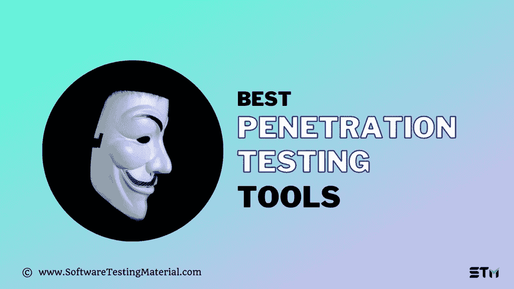

# 2022 年 18 款最佳渗透测试工具(免费和付费)

> 原文:[https://www . software testing material . com/penetration-testing-tools/](https://www.softwaretestingmaterial.com/penetration-testing-tools/)

你正在寻找最好的渗透测试工具吗？

在本帖中，我们将带来一些最好的 Web 应用渗透测试工具。我们回顾并比较了目前最好的笔测试工具。

*   [What is penetration testing?](#what-is-penetration-testing)
*   [What is a penetration testing tool?](#what-are-penetration-testing-tools)
*   [Best Pen Testing Tool](#best-pen-testing-tools)
    *   1 .邀请
    *   [2 .Acunetix](#Acunetix)
    *   [3 号。转移〔t1〕](#Metasploit)
    *   [4。wireshark](#Wireshark)
    *   [5。cyver〔t1〕](#NMap)
    *   [6 号。nmap〔t1〕](#NMap)
    *   [七号.w3af](#w3af)版
    *   [#8。Spyse](#Spyse)
    *   [9 号。卡莉 Linux〔t1〕](#Kali-Linux)
    *   [#10。 Nessus](#Nessus)
    *   [#11。 Cain & Abel](#Cain-And-Abel)
    *   [#12。 Zed attack agent](#Zed-Attack-Proxy)
    *   第十三课.渗透测试工具
    *   [#14。 John the Ripper](#John-The-Ripper)
    *   [#15。 THC Hydra](#THC-Hydra)
    *   [16。包囊〔t1〕](#Burpsuite)
    *   [17 号.sqlpmap](#SqlMap)的缩写形式
    *   [18。SQL ninja〔t1〕](#Sqlninja)
*   [Conclusion](#conclusion)

## 什么是渗透测试？

渗透测试也是一种安全测试，用于评估系统(硬件、软件、网络或信息系统环境)的安全性。该测试的目标是通过使用恶意技术评估系统的安全性来发现应用程序中存在的所有安全漏洞，并保护数据免受黑客攻击和维护系统的功能。它是一种非功能性测试，旨在进行授权的尝试来破坏系统的安全性。它也被称为笔测试或笔测试，进行这种测试的测试人员是渗透测试人员，也称为道德黑客。

> 必读:[渗透测试-完整指南](https://www.softwaretestingmaterial.com/penetration-testing-tutorial/)

## **什么是渗透测试工具？**

我们使用渗透测试工具来发现和利用系统中的漏洞。我们知道很难建立 100%安全的系统，但是我们必须知道我们将要处理什么样的安全问题。

## **最佳钢笔测试工具**

市场上有许多付费和免费的渗透测试工具。在这里，我们讨论一下在钢笔测试人员中流行的 15 种渗透测试工具。

### 1 .邀请

Invicti 是一个 web 应用程序安全扫描器。这是一个自动的，非常准确，易于使用的网络应用程序安全扫描器。它用于自动识别网站、web 应用程序和 web 服务中的安全问题，如 SQL 注入和跨站点脚本(XSS)。它的基于证据的扫描技术不仅仅报告漏洞，它还产生概念证明，以确认它们不是误报。因此，在扫描完成后，没有必要浪费时间手动验证已识别的漏洞。

它是一个商业工具。

**Invicti 安全扫描仪功能:**

Invicti 的一些特点如下:

*   脆弱性评估
*   高级 web 扫描
*   基于证据的扫描技术，用于精确的漏洞检测和扫描结果
*   完全支持 HTML5
*   Web 服务扫描
*   HTTP 请求生成器
*   SDLC 集成
*   报告
*   剥削
*   人工测试
*   反 CSRF(跨站点请求伪造)令牌支持
*   自动检测自定义 404 错误页面
*   REST API 支持
*   反 CSRF 的象征性支持

[Download Invicti](https://www.softwaretestingmaterial.com/go/invicti-pen-test-tool/)

* * *

### **2 .Acunetix**

Acunetix 是领先的 web 漏洞扫描器之一，可以自动扫描任何网站。它检测超过 4500 个 web 漏洞，包括 SQL 注入、XSS、XXE、SSRF 和主机头注入的所有变种。它的 DeepScan 爬虫扫描 HTML5 网站和大量使用 AJAX 的客户端 spa。它允许用户将发现的漏洞导出到问题跟踪器，如阿特拉斯 JIRA、GitHub、微软 Team Foundation Server (TFS)。它可以在 Windows、Linux 和在线上使用。

> *不要错过我们对* [Acunetix](https://www.softwaretestingmaterial.com/acunetix-web-application-security-scanner/) 的详细回顾

**Acunetix 特性:**

Acunetix 的一些功能如下:

*   深度抓取和分析–自动扫描所有网站
*   漏洞检测率最高，误报率低
*   集成漏洞管理–确定威胁的优先级并控制威胁
*   与流行的 WAFs 和问题跟踪器集成，如 JIRA，GitHub，TFS
*   免费网络安全扫描和手动测试工具
*   在 Windows、Linux 和在线上运行

[Download Acunetix](https://www.softwaretestingmaterial.com/go/acunetix-pen-test-tool/)

* * *

### **3 号。转移〔t1〕**

Metasploit 是一个计算机安全项目，为用户提供有关安全漏洞的重要信息。

Metasploit framework 是一个开源的渗透测试和开发平台，为您提供对各种应用程序、操作系统和平台的最新漏洞利用代码的访问。

它可以用于 web 应用程序、服务器、网络等。它有一个命令行和 GUI 可点击界面，可以在 Windows、Linux 和苹果 Mac OS 上运行。这是一个商业产品，但它带有一个免费的有限试用。

**Metasploit 特性:**

Metasploit 的一些特性如下:

*   它有一个命令行和 GUI 界面
*   它可以在 Linux、Windows 和 Mac OS X 上运行
*   网络发现
*   漏洞扫描程序导入
*   基本剥削
*   模块浏览器
*   手工开采
*   Metasploit community edition 免费提供给 InfoSec 社区

[Download Metasploit](https://www.metasploit.com/)

* * *

### **4 .Wireshark**

Wireshark 是一种免费的开源渗透测试工具。基本上，它是一个网络协议分析器，它让您捕获和交互式浏览计算机网络上运行的流量。它可以在 Windows、Linux、Unix、Mac OS、Solaris、FreeBSD、NetBSD 和许多其他操作系统上运行。它可以被网络专业人员、安全专家、开发人员和教育工作者广泛使用。通过 Wireshark 检索的信息可以通过 GUI 或 TTY 模式的 TShark 实用程序查看。

**Wireshark 功能:**

Wireshark 的一些功能如下:

*   深入检查数百个协议
*   实时捕获和离线分析
*   它可以在 Windows、Linux、UNIX、macOS、Solaris、FreeBSD、NetBSD 和许多其他平台上运行
*   捕获的网络数据可以通过 GUI 或 TTY 模式的 TShark 实用程序来浏览
*   丰富的 VoIP 分析
*   读/写许多不同的捕获文件格式
*   实时数据可以从互联网、PPP/HDLC、ATM、蓝牙、USB、令牌环等读取。,
*   可以将着色规则应用于数据包列表，以便进行快速直观的分析
*   用 gzip 压缩的捕获文件可以动态解压缩
*   输出可以导出到 XML，PostScript，CSV 或纯文本

[Download Wireshark](https://www.wireshark.org/)

* * *

### **5 号。cyver〔t1〕**

Cyver Core 是一个 pentest 管理平台，旨在通过数字工作管理、看板、时间表、客户端管理和虚拟漏洞库管理来自动化 pentest 开销。该工具使用 pentest 模板，可以针对每个客户端进行设置，以自动重复工作。此外，它使用自动化功能从工具中导入票据，通过云门户将它们作为调查结果与客户共享，并根据客户的配置文件将它们导入报告模板。

Cyver Core 还提供工作和任务管理清单、合规规范/框架和团队管理工具。该平台的入门版在€每月售价 99 英镑，但专业版在€每月售价 449 英镑。

**Cyver 核心功能:**

Cyver Core 的一些特性如下:

*   报告自动化
*   合规规范
*   漏洞扫描器集成
*   Pentest 清单
*   项目模板
*   调查结果管理
*   漏洞库
*   项目工作流程和管道
*   看板板
*   团队和角色管理
*   分配的任务
*   平台内通信
*   客户端门户
*   客户端工具集成
*   Pentest 洞察
*   报表生成
*   复试管理
*   云访问

[Download Cyver](https://core.cyver.io/)

* * *

> 更多阅读: [JIRA 面试问题](https://www.softwaretestingmaterial.com/jira-interview-questions/)

### **6 号。nmap〔t1〕**

NMap 是网络映射器的缩写。这是一个免费的开源安全扫描工具，用于网络探测和安全审计。它可以在 Linux、Windows、Solaris、HP-UX、BSD 变体(包括 Mac OS)、AmigaOS 上运行。它用于确定网络上有哪些主机可用、这些主机提供什么服务、它们运行什么操作系统和版本、使用什么类型的包过滤/防火墙等。许多系统和网络管理员发现它对于日常任务非常有用，例如网络清点、检查开放端口、管理服务升级计划以及监控主机或服务正常运行时间。它带有命令行和 GUI 界面

**NMap 端口扫描工具功能:**

NMap 的一些功能如下:

*   它发现网络上的主机
*   它识别目标主机上打开的端口，为审计做准备
*   它用于确定网络清单、网络映射、维护和资产管理
*   寻找并利用网络中的漏洞
*   它生成网络上主机的流量、响应分析和响应时间测量

[Download NMap](https://nmap.org/)

* * *

### **第七个 w3af**

W3af 是一个 Web 应用攻击和审计框架。它通过发现和利用所有 web 应用程序漏洞来保护 web 应用程序。它可以识别 200 多个漏洞，并降低您站点的整体风险。它识别诸如 SQL 注入、跨站点脚本(XSS)、可猜测的凭证、未处理的应用程序错误和 PHP 错误配置等漏洞。它有一个图形和控制台用户界面。它可以在 Windows、Linux 和 Mac OS 上运行。

**W3af 特性:**

W3af 的一些特性如下:

*   将 web 和代理服务器集成到代码中
*   将有效负载注入 HTTP 请求的几乎每个部分
*   代理支持
*   HTTP 基本和摘要式身份验证
*   用户代理伪造
*   向请求添加自定义标题
*   Cookie 处理
*   HTTP 响应缓存
*   DNS 缓存
*   使用多部分上传文件

这是一个免费的工具

[Download w3af](http://w3af.org/)

* * *

### **#8\. Spyse**

一种搜索引擎，使用 OSINT 机制(开源智能工具)来收集、处理和提供有关网络各种元素的结构化信息。所有 Spyse 用户都能够对以下网络元素执行详细搜索:

**Spyse 特性:**

*   域和子域
*   IP 地址和子网
*   加密证书
*   协议
*   开放端口
*   谁的唱片
*   自治系统

[Download Spyse](https://spyse.com/)

* * *

### **9 号。Kali Linux**

Kali Linux 是一个开源的笔测试工具，由进攻性安全有限公司维护和资助。它只支持 Linux 机器。

Kali 包含 600 多种渗透测试工具，这些工具适用于各种信息安全任务，如渗透测试、安全研究、计算机取证和逆向工程。

**卡莉 Linux 特性:**

Kali Linux 的一些特性如下:

*   Kali ISOs 的完全定制和实时构建允许我们创建自己的 Kali Linux 映像
*   末日 ISO 和其他卡利食谱
*   Kali Linux 的云版本可以在 Amazon Elastic Compute Cloud 中轻松设置
*   它包含了一堆集合不同工具集的元包集合
*   全磁盘加密(FDE)
*   为视障用户提供的辅助功能
*   具有多个持久性存储的实时 USB

[Download Kali Linux](https://www.kali.org/)

* * *

### **#10。奈瑟斯**

Nessus 是一个针对安全从业者的漏洞评估解决方案，由一家名为 Tenable Network Security 的公司创建和管理。它有助于识别和修复各种操作系统、设备和应用程序中的漏洞，如软件缺陷、缺失的补丁、恶意软件和错误配置。它支持 Windows、Linux、Mac、Solaris 等。,

**Nessus 特性:**

Nessus 的一些功能如下:

*   可以轻松定制报告，按漏洞或主机排序，创建执行摘要，或比较扫描结果以突出显示更改
*   它既检测网络上主机的远程缺陷，也检测它们缺失的补丁和本地缺陷
*   识别允许远程攻击者从系统中访问敏感信息的漏洞
*   移动设备审计
*   配置审计

[Download Nessus](http://www.tenable.com/products/nessus)

* * *

### **11。该隐〔T2〕亚伯〔t1〕**

Cain & Abel(通常缩写为 Cain)是一个用于 Microsoft Windows 的密码恢复工具。它破解加密的密码或网络密钥。它使用网络数据包嗅探等方法恢复各种类型的密码，使用字典攻击、暴力破解和密码分析攻击等方法破解加密的密码。

**该隐&亚伯特征:**

Cain & Abel 密码破解程序或密码破解工具的一些功能如下:

*   WEP(有线等效保密)破解
*   能够记录 VoIP 对话
*   解码加密密码
*   显示密码框
*   发现缓存的密码
*   转储受保护的存储密码

[Download Cain And Abel](http://cain-abel.en.softonic.com/download)

* * *

### **#12。Zed 攻击代理**

ZAP 是一个免费的开源 web 应用程序安全扫描工具。它在开发和测试阶段发现 web 应用程序中的安全漏洞。它提供了自动扫描器和一套工具，允许我们手动查找安全漏洞。它的设计目的是供应用安全新手和专业渗透测试人员使用。它可以在 Windows、Linux、Mac OS X 等不同的操作系统上运行。

**ZAP 功能:**

ZAP 自动化渗透测试的一些特性如下:

*   拦截代理服务器
*   传统和 AJAX 蜘蛛
*   自动扫描仪
*   被动扫描仪
*   强制浏览
*   去你妈的
*   Web 套接字支持

[Download Zed Attack Proxy](https://www.owasp.org/index.php/OWASP_Zed_Attack_Proxy_Project)

* * *

### **#13。Pentest 工具**

Pentest Tools 是超过 25 个渗透测试工具的综合集合，其中一个轻量级版本作为免费工具[提供。这种可搜索数据库、自动发现、复杂分析、成熟技术和专家评论的独特组合使其成为渗透测试人员、安全专家和网络管理员的绝佳资源。](https://pentest-tools.com/information-gathering/google-hacking)

找出任何网络和网站上存在的漏洞，并发现可能试图利用这些漏洞的威胁。Pentest Tools 还能够执行侦察并快速确定组织的攻击面，在被动扫描的同时找到目标。

使用安全工具检查安全风险也很容易。扫描提供了对站点安全性的详细评估，描述简单易懂，并附有详细的风险分析和补救建议。Pentest Tools 能够通过从 VPN 扫描绕过网络限制，同时仍能快速提供结果。

Pentest Tools 有 11 个强大的渗透测试工具，可通过 API 集成到 web 应用程序、网络或仪表板中。这些工具通过 API 可以测试和保护应用程序和网络。

**Pentest 工具特性:**

Pentest 工具的一些功能如下:

*   提供 25 种以上易于使用的自动化工具。
*   Web 漏洞和 CMS 扫描器。
*   网络漏洞扫描器。
*   发现隐藏、敏感和易受攻击文件的攻击性工具。
*   用于发现攻击面、相关域和开放端口的侦察工具。
*   2 次免费每日扫描或每月和每年的定价计划，起价为 93 美元/月。
*   所有计划的 10 天退款保证。

[Download Pentest Tools](https://www.owasp.org/index.php/OWASP_Zed_Attack_Proxy_Project)

* * *

### **#14。开膛手约翰**

开膛手约翰(又名 JTR)是一个免费的开源密码破解工具，旨在破解非常复杂的密码。这是最流行的密码测试和破解程序之一。它最常用于执行字典攻击。它有助于识别网络中的弱密码漏洞。还支持用户免受暴力破解和彩虹破解攻击。它适用于 UNIX、Windows、DOS 和 OpenVMS。它以专业和免费的形式出现。

[Download John The Ripper](http://www.openwall.com/john/)

* * *

### **#15。九头蛇**

THC-Hydra 也叫 Hydra，是流行的密码破解工具之一。另一个排队的密码破解者是 THC Hydra。它支持 GUI 和命令行用户界面。它可以通过字典攻击来解密许多协议和应用程序的密码。它可以对 50 多种协议进行快速字典攻击，包括 cisco、telnet、FTP、HTTP、HTTPS、MySQL、SVN 等。，是一款快速稳定的网络登录黑客工具。该工具允许研究人员和安全顾问发现未经授权的访问。

[Download THC Hydra](https://github.com/vanhauser-thc/thc-hydra)

* * *

### **16。包囊〔t1〕**

Burpsuite 是一个测试 Web 应用程序安全性的图形化工具。它是由 PortSwigger Web Security 开发的。它是为 web 应用程序安全检查提供解决方案而开发的。它有三个版本，如免费的社区版、专业版和企业版。Community edition 显著减少了功能。Burp 代理允许手动测试人员拦截浏览器和目标应用程序之间的所有请求和响应，甚至在使用 HTTPS 的时候。除了基本功能(如代理服务器、扫描仪和入侵者)之外，该工具还包含高级选项，如蜘蛛、中继器、解码器、比较器、序列器、扩展器 API 和 clickbandit 工具。它可以在 Windows、Mac OS X 和 Linux 环境下工作。

[Download Burp Suite](http://portswigger.net/burp/)

* * *

### **17 号。sqlpmap**的缩写形式

Sqlmap 是一个免费的开源渗透测试工具。它自动化了检测和利用 SQL 注入问题以及入侵数据库服务器的过程。它配备了许多检测引擎和终极渗透测试仪的许多功能。它有一个命令行界面。它可以在 Linux、Windows 和 Mac OS X 上运行。

**SqlMap 特性:**

SqlMap 的一些功能如下:

*   完全支持数据库管理系统，如 MySQL、Oracle、PostgreSQL、Microsoft SQL、Microsoft Access、IBM DB2、SQLite、Sybase、SAP MaxDB、HSQLDB、H2 和 Informix。
*   完全支持六种 SQL 注入技术，如基于布尔的盲、基于时间的盲、基于错误的盲、基于联合查询的盲、堆栈查询和带外查询。
*   支持不通过 SQL 注入直接连接到数据库
*   支持枚举用户、密码哈希、权限、角色、数据库、表和列
*   自动识别密码散列格式，并支持使用基于字典的攻击来破解它们
*   支持根据用户的选择转储整个数据库表或特定的列
*   支持在所有数据库的表中搜索特定的数据库名称、表或列
*   支持在攻击者机器和数据库服务器之间建立 TCP 连接

[https://sqlmap.org/](http://sqlmap.org/)

* * *

### **18。SQL ninja〔t1〕**

Sqlninja 是一个开源的渗透测试工具。该工具的目的是利用 web 应用程序上的 SQL 注入漏洞。它使用 Microsoft SQL Server 作为后端。它有一个命令行界面。它可以在 Linux 和苹果 Mac OS X 上运行。

**Sqlninja 特性:**

Sqlninja 的一些特性如下:

*   远程 SQL Server 的指纹识别
*   TCP 和 UDP 的直接和反向外壳
*   如果原来的 XP cmdshell 已被禁用，则创建自定义的 XP cmdshell
*   反向扫描，以寻找可用于反向外壳的端口
*   远程数据库服务器上的操作系统权限提升
*   从远程数据库提取数据

[Download SQL Ninja](http://sqlninja.sourceforge.net)

* * *

其他一些渗透测试工具如下:

市场上有很多黑客工具和软件。因此，我们正试图将其他一些黑客工具列入这个列表。

**#19。空气破裂**

**网站**:【https://www.aircrack-ng.org/ T2】

**20。蜘蛛〔t1〕**

**网站**:【http://www.arachni-scanner.com/ T2】

**#21。牛肉**

**网站**:【https://beefproject.com/ T2】

**#22\. NIKTO**

**网站**:[https://github . com/sullo/nikto](https://github.com/sullo/nikto)

**#23。画布**

**网站**:【http://www.immunitysec.com T2】

**#24。社会工程师工具包**

**网站**:【https://www.social-engineer.org T2】

**25。维拉码〔t1〕**

**网站**:【https://www.veracode.com T2】

**#26。IBM AppScan**

**网站**:【http://www-03.ibm.com/software/products/en/appscan T2】

**27。Nagios**

**网站**:【http://www.nagios.org/ T2】

**28。web 阿拉伯语〔t1〕**

**网址**:[http://www . OWASP . org/index . PHP/Category:OWASP _ web scarab _ Project](http://www.owasp.org/index.php/Category:OWASP_WebScarab_Project)

**29。马耳他〔t1〕**

**网站**:【http://www.paterva.com/ T2】

**30。反冲〔t1〕**

**网站**:【http://ironwasp.org/ T2】

**31。hccon FSF〔t1〕**

**网站**:【http://www.hcon.in/ T2】

**32。open vas〔t1〕**

**网站**:【http://www.openvas.org/ T2】

**#33。Ettercap**

**网站**:【https://ettercap.github.io/ettercap/downloads.html T2】

## **结论**

我们尽力列出了流行的渗透测试工具(开源的和商业的)。在下面的评论中让我们知道你最喜欢的最好的渗透测试软件。如果你觉得我忘了提到你最喜欢的工具，请在下面的评论中告诉我们。我们会试着把它加入我们的列表并更新这篇文章。

**相关帖子:**

*   [最佳动态应用安全测试(DAST)软件](https://www.softwaretestingmaterial.com/dast-software/)
*   [最佳漏洞评估扫描工具](https://www.softwaretestingmaterial.com/vulnerability-assessment-scanning-tools/)
*   [最佳渗透测试公司](https://www.softwaretestingmaterial.com/penetration-testing-companies/)
*   [最佳 Nessus 替代品](https://www.softwaretestingmaterial.com/nessus-alternatives/)
*   [最佳打嗝组合选择](https://www.softwaretestingmaterial.com/burp-suite-alternatives/)
*   [最佳渗透测试工具](https://www.softwaretestingmaterial.com/penetration-testing-tools/)
*   [渗透测试指南](https://www.softwaretestingmaterial.com/penetration-testing-tutorial/)
*   [PCI 渗透测试指南](https://www.softwaretestingmaterial.com/pci-penetration-testing/)
*   [最佳安全测试工具](https://www.softwaretestingmaterial.com/open-source-security-testing-tools/)
*   [最佳 Web 应用测试工具](https://www.softwaretestingmaterial.com/web-application-testing-tools/)
*   [安全测试指南](https://www.softwaretestingmaterial.com/security-testing-tutorial/)