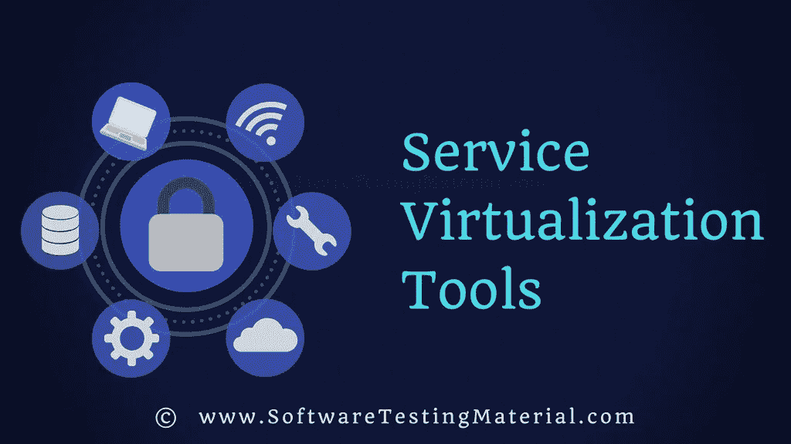

# 2022 年 10 大最佳服务虚拟化工具

> 原文:[https://www . software testing material . com/service-virtual ization-tools/](https://www.softwaretestingmaterial.com/service-virtualization-tools/)

在这篇文章中，我们看到了最好的服务虚拟化工具。一些流行的**服务虚拟化工具**如下:

*   [什么是服务虚拟化？](#what-is-service-virtualization)
*   [为什么要进行服务虚拟化测试？](#why-service-virtualization-testing)
*   [流行的服务虚拟化软件](#Features-of-Test-Management-Tools)
    *   [1) Parasoft 虚拟化](#1-parasoft-virtualize)
    *   2) IBM Rational 测试虚拟化服务器
    *   [3)微焦点数据模拟软件](#3-micro-focus-data-simulation-software)
    *   [4) Broadcom 服务虚拟化(原 CA 服务虚拟化)](#4-broadcom-service-virtualization-formerly-ca-service-virtualization)
    *   5)智能熊服务博锐
    *   [6) Tricentis Tosca 协调服务虚拟化](#6-tricentis-tosca-orchestrated-service-virtualization)
    *   7)线模
    *   [8)交通鹦鹉](#8-traffic-parrot)
    *   气垫船
    *   江湖骗子

## **什么是服务虚拟化？**

服务虚拟化模拟设备、API、网络、数据库等组件的行为。，在测试时不可用或难以访问，并允许并行进行深入的[功能测试](https://www.softwaretestingmaterial.com/functional-testing/)和[性能测试](https://www.softwaretestingmaterial.com/performance-testing-tutorial/)。

查看我们的指南，了解有关[服务虚拟化的更多信息。](https://www.softwaretestingmaterial.com/service-virtualization-guide/)

## **为什么要进行服务虚拟化测试？**

*   参与应用程序生命周期的每个人都可以使用它。
*   它允许您通过模拟不可用的组件依赖关系，在应用程序开发过程的早期进行测试。因此您可以毫无延迟地完成集成测试。
*   它允许团队并行工作
*   降低成本并节省大量时间
*   更容易进行概念验证(POC)
*   更好的测试覆盖率
*   它给出了更好的测试覆盖率

## **流行的服务虚拟化软件**

在本节中，我们将详细了解上述工具。

*   它带有一个强大的可视化界面，允许您管理和创建虚拟服务
*   即使是非技术团队成员也可以轻松使用它
*   与第三方 DevOps 工具集成，如 Jenkins、Bamboo、吉拉、TeamCity 或 Azure DevOps。
*   它支持通过内部或云服务(如 Amazon EC2、Microsoft Azure)进行持续测试。

了解关于 [Parasoft 虚拟化](https://www.parasoft.com/)的更多信息

### 2) IBM Rational 测试虚拟化服务器

IBM Rational Test 虚拟化服务器软件支持在开发生命周期中对复杂应用程序进行早期的、更加并行的、持续的测试。它虚拟化了部分或全部应用程序或数据库，允许软件测试团队向前推进，而无需等待那些资源的可用性来开始测试。

**特性:**

*   它使您能够更新、重用和共享虚拟化服务
*   支持 Software AG、TIBCO 以及医疗保健、金融和 B2B 领域的其他集成提供商提供的一系列中间件和消息传递技术。
*   它支持与其他工具的集成，如 IBM Rational Quality Manager、协作生命周期管理
*   灵活的定价和部署
*   它提供了协作的测试执行和计划

了解更多关于 Rational Test 虚拟化服务器的信息

### **3)微焦点数据模拟软件**

微焦点服务虚拟化(以前的 HPE 服务虚拟化)是一个模拟软件，让您按计划进行，并专注于服务质量，而不是服务限制。它允许开发人员和质量保证人员虚拟化微服务的行为。

它是一个商业工具。

**Features: **

*   轻松创建应用程序行为的模拟。
*   轻松修改数据、网络和性能模型。
*   通过支持用户角色、访问控制列表和配置文件，可以从任何地方对其进行管理。
*   在日常测试实践中易于配置和使用虚拟服务。
*   它可以与 Performance Center、LoadRunner、ALM 和统一功能测试集成。
*   它允许您在交付周期的早期执行测试。

了解更多关于[微焦点数据模拟软件](https://software.microfocus.com/en-us/products/service-virtualization/overview)

### **4)博通服务虚拟化*(原 CA 服务虚拟化)***

Broadcom Service Virtualization product (formerly CA Service Virtualization) simulates unavailable systems across the software development lifecycle (SDLC), allowing developers, testers, integration, and performance teams to work in parallel for faster delivery and higher application quality and reliability. You’ll be able to accelerate software release cycle times, increase quality, and reduce software testing environment infrastructure costs.

**特性:**

*   它支持并行软件开发和测试，从而加快上市时间。
*   在软件开发生命周期的早期进行测试，这样问题更便宜，也更容易解决。
*   降低第三方服务或按使用付费服务的成本。

了解更多信息 [Broadcom 服务虚拟化](https://www.ca.com/us/products/ca-service-virtualization.html)

### 5)智能熊服务博锐

Smartbear ServiceVPro 是一个服务虚拟化和服务 API 模拟工具。ServiceV Pro 的 API 虚拟化帮助我们在预算内按时交付 API。虚拟化 REST 和 SOAP APIs、JDBC、TCP 等，以加快开发和测试周期。

**特性:**

*   它允许我们记录和使用现有的服务，或者从头开始从 API 定义生成虚拟服务。
*   允许您在本地机器上创建、配置和部署您的 mock，或者部署在私有或公共云中进行共享。
*   提供 web UI 来分析每个虚拟服务的性能和流量。
*   它立即生成动态模拟数据
*   它模拟服务器端的行为和网络性能
*   实时服务记录和交换

了解更多信息 [Smartbear ServiceVPro](https://smartbear.com/product/ready-api/servicev/overview/)

### **6) Tricentis Tosca 协调服务虚拟化**

Tricentis 协调服务虚拟化(OSV)通过稳定对相关系统的访问，允许您完整、连续、可靠地执行测试。

**特性:**

*   它支持持续集成和持续测试
*   消除测试数据争论和测试延迟
*   它支持左移测试
*   降低测试成本

了解更多信息 [Tricentis Tosca 测试驱动的服务虚拟化](https://www.tricentis.com/orchestrated-service-virtualization/)

### 7)线模

WireMock 是一个基于 HTTP 的 API 的模拟器工具。它使我们能够保持测试，即使我们依赖的 API 不存在或者不完整。它支持验证实际 API 不会可靠产生的边缘情况和故障模式。它动作很快，将构建时间从几个小时减少到几分钟。

**特性:**

*   它的灵活部署允许您从我们的 JUnit 测试、Java 应用程序、Servlet 容器中运行 WireMock，或者作为一个独立的进程运行。
*   它支持 XML 和 JSON
*   提供记录和回放，并允许我们通过从现有 API 捕获流量来快速运行。

了解更多信息 [WireMock](http://wiremock.org/)

### **8)交通鹦鹉**

Traffic Parrot 是一个 API 模仿和服务虚拟化工具。它通过消除创建测试数据或环境的麻烦来模拟 API 和服务，并允许您测试微服务。

**特性:**

*   支持的协议有 HTTP(S)、JMS、IBM MQ、文件传输和 gRPC
*   它加快了交付，提高了质量，并缩短了上市时间
*   支持手动和自动测试。更容易开发和测试您的应用、微服务和系统。
*   兼容 Docker、Kubernetes、OpenShift、微软 Azure、亚马逊 AWS、谷歌云。
*   它支持持续集成环境，如 Jenkins Slaves、TeamCity Build Agents、Bamboo 或 CircleCI。
*   它支持 Windows、Linux、macOS 等操作系统，以及其他运行 Java 1.7 或更高版本的系统。

了解更多[交通鹦鹉](https://trafficparrot.com/)

### 气垫船

SpectoLabs 的 Hoverfly 是一个开源的 API 模拟工具。它是一个轻量级且易于使用的工具，允许开发人员和测试人员创建 API 的真实模拟。它是用 JVM 语言 Go 写的。它支持 Windows、Linux、macOS 等操作系统，以及原生 Java 或 Python 语言绑定。

了解更多关于 [Hoverfly](https://hoverfly.io/) 的信息

点击这里查看 [Hoverfly Cloud](https://cloud.hoverfly.io/) ，它提供 14 天免费试用。

### 江湖骗子

Mountebank 是一个开源的服务虚拟化工具。它有助于跨平台、多协议测试。开发人员/测试人员只需要简单地将他们的 AUT 指向 mountebank，而不是真正的依赖，并像他们对传统存根和模拟那样进行测试。

了解更多关于[江湖骗子](http://www.mbtest.org/)的信息

**结论:**

我们已经包括了我们遇到的大多数工具。如果我们错过了任何工具，请在评论区告诉我们。我们将努力把这些包括在我们的服务虚拟化工具列表中(最佳开源微服务和模仿工具)。您可能还想看看我们的 API 测试工具终极列表，其中包含了[流行的 API 测试工具](https://www.softwaretestingmaterial.com/best-api-testing-tools/)。

如果你想浏览我们最新的帖子，那就去看看我们的[主页](https://www.softwaretestingmaterial.com/)。

喜欢这个帖子？别忘了分享一下！

测试愉快！

*免责声明:这些服务虚拟化工具的顺序并不代表任何建议。*

下面是几篇精选的文章供你接下来阅读:

*   [API 测试工具](https://www.softwaretestingmaterial.com/best-api-testing-tools/)
*   [单元测试工具](https://www.softwaretestingmaterial.com/unit-testing-tools/)
*   [功能测试工具](https://www.softwaretestingmaterial.com/functional-testing-tools/)
*   [Web 应用测试工具](https://www.softwaretestingmaterial.com/web-application-testing-tools/)
*   [测试管理工具](https://www.softwaretestingmaterial.com/test-management-tools/)
*   [缺陷跟踪工具](https://www.softwaretestingmaterial.com/popular-defect-tracking-tools/)
*   [跨浏览器测试工具](https://www.softwaretestingmaterial.com/best-cross-browser-testing-tools/)
*   [自动化测试工具](https://www.softwaretestingmaterial.com/best-automation-testing-tools-2018/)
*   [性能测试工具](https://www.softwaretestingmaterial.com/performance-testing-tools/)
*   [渗透测试工具](https://www.softwaretestingmaterial.com/penetration-testing-tools/)
*   [回归测试工具](https://www.softwaretestingmaterial.com/regression-testing-tools/)