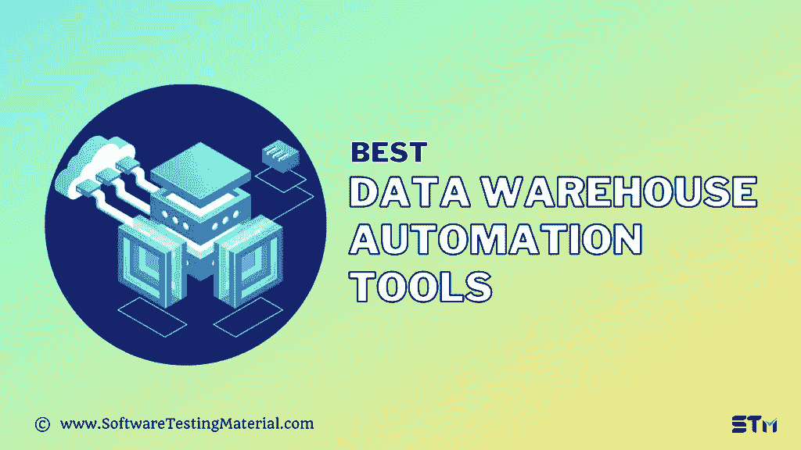

# 2022 年 11 款最佳数据仓库自动化工具

> 原文:[https://www . software testing material . com/data-warehouse-automation-tools/](https://www.softwaretestingmaterial.com/data-warehouse-automation-tools/)

*   [数据仓库自动化的优势](#h-benefits-of-data-warehouse-automation)
*   [数据仓库自动化的特点](#h-features-of-data-warehouse-automation)
*   [数据仓库自动化工具列表](#h-list-of-data-warehouse-automation-tools)
    *   [#1。Redwood RunMyJobs](#h-1-redwood-runmyjobs)
    *   [2 .active batch〔t1〕](#h-2-activebatch)
    *   [#3。甲骨文数据仓库](#h-3-oracle-data-warehouse)
    *   [#4。亚马逊红移](#h-4-amazon-redshift)
    *   [#5。Zapbi ETL 数据仓库自动化软件](#h-5-zapbi-etl-data-warehouse-automation-software)
    *   [#6。WhereScape 数据仓库自动化](#h-6-wherescape-data-warehouse-automation)
    *   [#7。Astera ETL 软件](#7-astera-etl-software)
    *   [8 .Qlik 复合](#h-8-qlik-compose)
    *   [#9。按位限定符](#h-9-bitwise-qualidi)
    *   [#10。信息数据验证](#h-10-informatica-data-validation)
    *   [#11。Codoid ETL 测试服务](#h-11-codoid-etl-testing-services)
    *   [#12。数据缺口 ETL 验证器](#h-12-datagaps-etl-validator)
*   [结论](#h-conclusion)

数据仓库自动化是指自动化和简化数据仓库创建周期的策略，同时确保一致的质量和性能。DWA 被认为提供了数据仓库整个生命周期的近期自动化，从源代码分析到全面的文档记录，再到数据仓库的运行。

企业数据仓库(EDW)对于将历史数据用于业务报告功能至关重要。然而，通过手工 ETL 编码来编译和处理海量数据的标准方法不再有效。在当今竞争激烈的企业市场中，业务灵活性和时间至关重要。对于这样的需求，DWA 软件减少了构建和部署数据仓库以及为业务覆盖范围合成数据的人工工作。

## **数据仓库自动化的优势**

DWA 将通过自动化业务流程领域(如数据仓库自动化或源代码处理)来减少运营工作量。这使企业能够专注于核心业务流程，同时将他们从繁琐耗时的流程部署过程中解脱出来。

数据仓库应用程序使得自动运行应用程序和报告成为可能。这意味着，作为组织的数据仓库过程的一部分，管理员不必手动执行某些操作，例如检索信息、分析信息并将其报告给某个团队，而是可以非常轻松地完成这些操作，而且只需很少的额外工作。

**特性:**

*   Redwood RunMyJobs 协调 SAP、Oracle 和其他供应商平台的自动化。
*   任何应用程序或数据库都可以用来创建自动化的数据拉取，包括 Hadoop。
*   确保数据安全且可访问。
*   简单的 API 向导将帮助您快速集成 REST 或 SOAP web 服务。

**判决:**

Redwood 的数据仓库管理平台的功能允许您轻松创建流程，并将其导入现有的 ETL、OLAP 和 BI 工具。它使您能够从一个位置监视数据管道活动。它能够根据您定义的任何标准执行流程。

定价:他们还提供免费演示。联系他们索取报价。

[Learn more – Redwood RunMyJobs](https://www.redwood.com/lp/ex0/workload-automation/)

### **2 .active batch〔t1〕**

ActiveBatch 提供了数据仓库和 ETL 自动化功能，您可以使用这些功能优化您的 ETL 过程，以实现实时数据仓库。它还编排端到端的数据仓库流程。使用该工具，您可以通过整合和协调多个数据管理工具(如 ETL 工具和 BI 平台)来简化数据仓库。

**特性:**

*   您可以自动更新数据存储库，以提高数据质量和报告。
*   借助该工具，您可以管理和控制不同 IT 系统中的大量数据，并确保按时提交准确的报告。
*   它根据外部条件触发数据仓库和 ETL 过程。您还可以执行基于约束的计划和精确的日期/时间计划。
*   您可以在数据仓库流程中添加多个检查点来重新启动步骤，而不会影响整个批处理流程。
*   它让用户能够标准化整个企业的数据合规性策略。

**结论:**借助 ActiveBatch，您可以构建可靠的工作流来管理不同异构系统之间的数据和依赖关系。它是帮助您自动化、监控和管理关键数据仓库流程的最佳 It 解决方案之一。

**定价:**联系他们进行报价。他们提供 30 天的免费试用期。

[Learn more – ActiveBatch](https://www.advsyscon.com/)

### **#3。甲骨文数据仓库**

它是一种云数据仓库服务，消除了操作数据仓库、保护数据和创建数据驱动的应用程序的所有复杂性。Oracle 数据仓库解决方案还自动提供、配置、保护、调整、扩展和备份仓库数据。

它提供了用于自助服务数据加载、数据转换、业务模型、自动洞察和内置融合数据库功能的工具，支持跨多种数据类型的简单查询和机器学习分析。

**特性:**

*   该工具在 Oracle 公共云和使用 Oracle Cloud@Customer 的客户数据中心都可用。
*   您可以创建数据驱动的应用程序和构建复杂的分析模型。
*   它自动执行备份、性能调整、自动扩展、配置和修补等常见任务，无需停机、人工干预或过度配置。
*   Oracle 数据仓库通过加密静态和动态数据，提供全面的数据和隐私保护。
*   您可以将来自各种企业系统、电子表格和第三方数据源的数据整合到一个集成的数据存储中。

**结论:**这是一个完整的解决方案，它使用融合数据库，为多模式数据和多种工作负载提供内置支持。使用该软件，您可以减少多达 90%的管理工作量。它还使业务团队能够在没有 It 团队帮助的情况下运作。

**定价:**其价格起价为每小时 1.3441 OCPU。

[Learn more – Oracle Data Warehouse](https://www.oracle.com/in/database/technologies/datawarehouse-bigdata.html)

### **#4。亚马逊红移**

Amazon Redshift 使用速度最快、应用最广泛的云数据仓库来分析您的所有数据。它是一个基于云的数据仓库，集成到您的数据湖和 AWS 服务中。它允许您使用 SQL 将数十亿字节的结构化和半结构化数据结合到您的数据仓库、操作数据库和数据湖中。您还可以使用开放格式(如 Apache Parquet)将查询结果保存到 S3 数据湖。

**特性:**

*   它是市场上最快的云数据仓库。新的 RA3 实例将帮助您处理性能密集型工作负载。与其他企业云数据仓库相比，它有助于将性能提高 3 倍。
*   它提供了性价比优势，随着您的数据仓库从千兆字节增长到千兆字节，这种优势会得到改善。
*   在 AQUA 的帮助下，Redshift 运行查询的速度比其他企业云数据仓库快 10 倍。
*   您可以自动扩展数据仓库存储容量，而无需支付额外的计算费用。

**结论:**这是一个强大、简单且经济高效的解决方案，可对数 Pb 的结构化和半结构化数据运行高性能查询。您还可以使用 QuickSight 或其他商业智能工具创建报告。红移可供小型、中型和大型企业使用。

定价:他们提供两个月的免费试用。It 价格从每小时 0.25 美元开始，到每年每 TB 1000 美元。

[Learn more – Amazon Redshift](https://aws.amazon.com/redshift/)

### **#5。Zapbi ETL 数据仓库自动化软件**

Zapbi 是另一个优秀的数据仓库自动化软件，使用它您可以自动访问、集成和准备结构化业务数据，以进行快速 bi 测试。它与多个 ERP、CRM 和财务系统和数据库兼容。您可以为 PowerBI、Tableau、Qlik 或任何自助式 BI 工具自动化数据管理。

在数据收集、数据集成、数据准备和数据治理的帮助下，它自动为 BI 用户收集、集成和准备数据。

**特性:**

*   ZAP 自动从 ERP、CRM、财务系统、数据库收集混合数据。文件等等。
*   它为大型复杂数据集提供了高速、稳定的数据迁移。
*   它有一个零代码的界面，遵循敏捷的方法。它提供了基于向导的自动化。
*   它处理多个云和本地系统。
*   ZAP 自动化语义层的特点是跨分类账查询、层次结构、聚合和物化计算。

**结论:**使用这个工具，用户可以自动化数据收集、数据建模、数据集成和数据仓库的创建。平台是灵活的。它可以满足您的所有报告需求，因为数据源可以轻松添加。

**定价:**联系他们进行报价。

[Learn more – Zapbi ETL Data Warehouse Automation Software](https://www.zapbi.com/etl-data-warehouse-automation/)

### **#6。WhereScape 数据仓库自动化**

WhereScape 提供了 WhereScape 3D 功能，您可以用它来规划、建模和设计任何类型的数据基础设施项目。它提供数据发现和分析功能来保护您的设计，并提供快速原型设计来与业务用户协作。WhereScape 提供的其他产品有 WhereScape Red 和 WhereScape Data Vault Express。

这是一个设计、开发、部署和操作的优秀平台。它包括 dimensional、3NF 和 Data Vault 2.0 方法。

**特性:**

*   支持微软 SQL Server、IBM DB2、IBM Netezza、Oracle、雪花、Teradata、Hadoop、Hive 等平台。
*   借助该工具，您可以快速跟踪数据基础架构项目的开发、部署和运营。它有助于减少新项目的交付时间、工作量、成本和风险。
*   借助 Data Vault 2.0 功能，您可以自动化整个生命周期。它还将初始开发时间加快了 2/3，快速迭代，快速响应变化，并提高了可维护性。
*   WhereScape 3D 还将生产时间缩短了 80%。

**结论:**它是一个领先的数据平台，为流行的目标数据平台提供现成的实践、优化的本机代码和特性。无论是内部部署、云还是两者的结合，WhereScape 都能提供最佳的数据自动化解决方案。

**定价:**联系他们进行报价。

[Learn more – WhereScape Data Warehouse Automation](https://www.wherescape.com/)

### **#7。Astera ETL 软件**

Astera 是一款高性能、用户友好的 ETL 软件，用于创建集成的数据生态系统。它为任何复杂的数据提供了数据集成和转换能力。它还支持来自复杂层次文件的各种格式的数据&结构化文档格式，如 EDI 和遗留数据。

**特性:**

*   它有一个无代码和用户友好的用户界面。
*   它提供基于集群的体系结构，通过在多个节点上分配作业来加速大型数据集的集成和转换。
*   Astera 拥有丰富的数据映射和转换能力。
*   您可以定义数据质量规则，并根据这些规则验证传入的数据，以便识别和更正缺失或不准确的值。

**结论:**这是一个企业就绪的 ETL 解决方案，为各种格式的任何规模的数据提供数据集成和转换能力。通过确保本地数据库、基于云的应用程序等的连接性，Astera 帮助公司获得其数据资产的统一视图，以做出整体的数据驱动型决策。该平台有助于跨首选位置同步、转换和移动数据。

**定价:**联系他们进行报价。他们还提供免费试用。

[Learn more – Astera ETL Software](https://www.astera.com/solutions/technology-solutions/etl/)

### **8 .Qlik 复合**

Qlik Compose，以前称为 Attunity Compose，是另一个强大的数据仓库软件。它使数据架构师和数据仓库团队能够设计、创建和操作企业数据仓库，而无需进行任何手动编码。它简化了数据仓库的设计、创建和操作，并加速了数据仓库生命周期的所有阶段。

**特性:**

*   在 Qlik Compose 的帮助下，企业可以在内部和云环境中快速启动新的数据仓库和数据集市。
*   您还可以更新数据仓库模型，并根据快速变化的业务需求添加新的数据源。
*   您还可以降低创建和维护数据仓库和数据集市的成本。
*   它还支持实时数据仓库。
*   您可以快速设计、创建、加载和维护数据集市。

**结论:** Qlik Compose 以更少的资源、更低的成本和更小的项目风险更快地交付商业价值。它允许企业导入行业标准模型，如 Inmon、Kimball 和 Data Vault。

**定价:**

*   qlik Sense Business——每个用户每月 30 美元
*   qlik Sense Enterprise SaaS——每个用户每月 70 美元

[Learn more – Qlik Compose](https://www.qlik.com/us/products/qlik-compose-data-warehouses)

### **#9。按位限定符**

Bitwise 是用于集中测试一个或多个 ETL 工具的另一个很好的工具。它提供以云为中心的数字化转型解决方案，能够转变流程、系统和应用。您可以在将数据集从多个操作系统转移到数据仓库的同时执行数据验证。这个工具可以用来自动化从任何源到任何目标的 ETL 测试。

**特性:**

它的主要特性包括大数据测试、JIRA 集成、内置的调度功能、对复杂转换规则的支持、逻辑测试数据生成等等。

它提供了管理、报告和跟踪功能。

**结论:**它提供了一个企业范围的解决方案，用于集中测试一个或多个 ETL 工具。

**定价:**联系他们进行报价。

[Learn more – Bitwise QualiDI](https://www.bitwiseglobal.com/in/services/innovations/qualidi/)

### **#10。信息数据验证**

它是一个 ETL 测试工具。没有编码技能，您可以更快地交付完整的、可重复的、可审计的测试覆盖。

**特性:**

*   它提供了从源到目标的测试。
*   Informatica 提供了 ETL 测试自动化和管理功能，以确保数据更新过程不会损害您的生产系统。
*   它提供了 ETL 测试的自动化和可见性，以确保在您的生产系统更新中交付可信数据。

**结论:**使用 Informatica，您可以减少 50%到 90%进行 ETL 测试所需的时间和资源。

**定价:**联系他们进行报价。

[Learn more – Informatica Data Validation](https://docs.informatica.com/data-integration/powercenter/10-5/data-validation-option-user-guide/introduction-to-data-validation-option/data-validation-option-overview.html)

### **#11。Codoid ETL 测试服务**

Codoid 是一个 ELT 和数据分析测试工具。它包括从源到目标的测试。然后，您可以使用 Codoid 提供的各种商业智能(BI)工具来生成有意义的报告、仪表板和可视化。

**特性:**

*   它执行的活动范围从审查数据模型到目标系统中的数据完整性和质量检查。
*   Codoid 还对数据完整性进行测试。
*   自动化元数据测试过程包括对数据类型、数据长度、索引/约束等的仔细检查。

**结论:**有了这个工具，您可以从测试覆盖、质量洞察、测试效率和协作中获益。它还提供了很好的导航/GUI 测试。

**定价:**联系他们进行报价。

[Learn more – Codoid ETL Testing Services](https://codoid.com/testing-services/data-analytics-testing-services/)

### **#12。数据缺口 ETL 验证器**

Datagaps 提供 ELT 测试工具，如 ELT validator。有了这个软件，您可以对 ETL、关系、平面文件、XML、NoSQL、云和大数据源进行自动化测试。

**特性:**

*   它能够在并行执行测试的同时，从各种数据源中提取并比较数百万条记录。
*   它提供了到各种数据源、关系数据库、云数据仓库、数据湖、平面文件和 SaaS 的连接。
*   Datagaps 还提供了数据模型驱动的接口来定义数据规则。

**结论:** ELT Validator 具有各种特性和功能，如数据概要测试、数据库元数据测试、端到端数据测试等等。

**定价:**联系他们进行报价。他们还提供 30 天的免费试用。

[Learn more – Datagaps ETL Validator](https://www.datagaps.com/etl-testing-tools/etl-validator/)

## **结论**

数据仓库自动化软件自动化了整个数据仓库周期，包括规划、设计、开发、部署、分析、变更管理和维护。这些工具提供了一个敏捷而灵活的平台，通过自动处理耗时且重复出现的问题来加速数据仓库，使企业能够将其资源重新集中在设计和优化上。这些是一些顶级的数据仓库自动化工具。

**相关帖子:**

*   [ETL 测试——完整指南](https://www.softwaretestingmaterial.com/etl-testing/)
*   [前 20 名 ETL 测试面试问题&答案](https://www.softwaretestingmaterial.com/etl-testing-interview-questions/)
*   [2022 年最佳 ETL 工具](https://www.softwaretestingmaterial.com/etl-tools/)
*   [2022 年十大最佳 IT 流程自动化软件](https://www.softwaretestingmaterial.com/it-process-automation-software/)