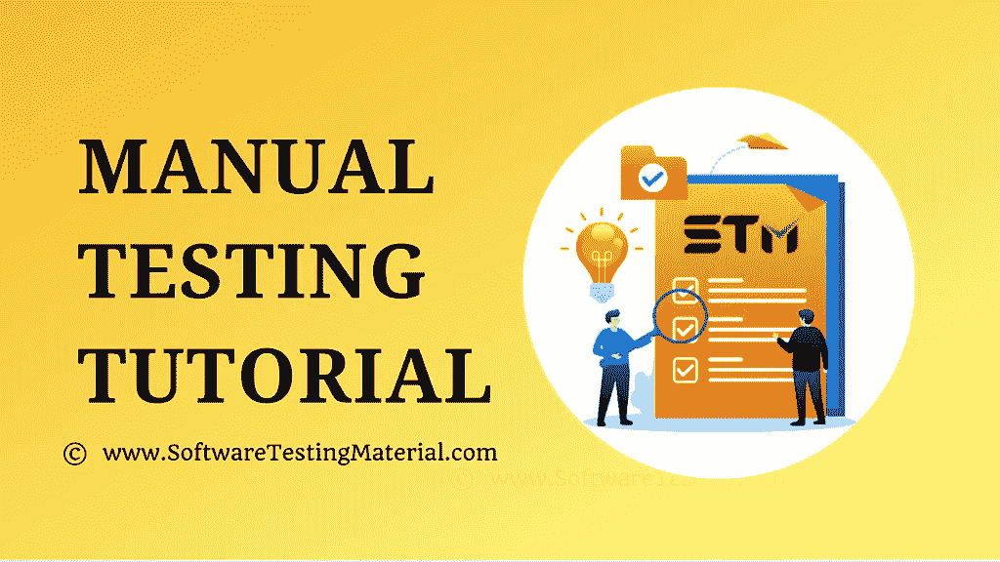

# 手动测试教程–完整指南|软件测试教程

> 原文:[https://www . software testing material . com/manual-testing-tutorial/](https://www.softwaretestingmaterial.com/manual-testing-tutorial/)

在这个免费的在线软件测试教程/手动测试教程中，我们用简单易懂的例子详细介绍了所有的手动测试概念。本教程有助于初学者到高级用户学习软件测试概念和实际例子。

**为什么要这个手工测试教程？**
本软件测试教程涵盖了从基础到高级测试概念。

**初学者学习手工测试教程的先决条件是什么&高级水平？**

*   基本的计算机知识
*   对学习软件测试感兴趣

**这个软件测试教程的目标受众是谁？**
任何有兴趣学习软件测试的人。

## **手动测试教程-目录**

点击下面的链接来查看这个手动测试教程中每个概念的详细内容。

*   [软件测试](https://www.softwaretestingmaterial.com/software-testing/)
*   [软件测试的原则](https://www.softwaretestingmaterial.com/principles-of-software-testing/)
*   [软件开发生命周期](https://www.softwaretestingmaterial.com/sdlc-software-development-life-cycle/)
*   [SDLC 中的瀑布模型](https://www.softwaretestingmaterial.com/waterfall-model-in-sdlc/)
*   [SDLC 中的螺旋模型](https://www.softwaretestingmaterial.com/spiral-model-in-sdlc/)
*   [SDLC 中的 V 模型](https://www.softwaretestingmaterial.com/v-model-in-sdlc/)
*   [敏捷 Scrum 方法论](https://www.softwaretestingmaterial.com/agile-scrum-methodology/)
*   [软件测试生命周期](https://www.softwaretestingmaterial.com/stlc-software-testing-life-cycle/)
*   [Bug 生命周期](https://www.softwaretestingmaterial.com/bug-life-cycle/)
*   [静态测试](https://www.softwaretestingmaterial.com/static-testing/)
*   [动态测试](https://www.softwaretestingmaterial.com/dynamic-testing/)
*   [软件测试的类型](https://www.softwaretestingmaterial.com/types-of-software-testing/)
*   [测试等级](https://www.softwaretestingmaterial.com/levels-of-testing/)
*   [性能测试类型](https://www.softwaretestingmaterial.com/performance-testing-types/)
*   [功能测试](https://www.softwaretestingmaterial.com/functional-testing/)
*   [非功能性测试](https://www.softwaretestingmaterial.com/non-functional-testing/)
*   [单元测试](https://www.softwaretestingmaterial.com/unit-testing/)
*   [集成测试](https://www.softwaretestingmaterial.com/integration-testing/)
*   [系统测试](https://www.softwaretestingmaterial.com/system-testing/)
*   [验收测试指南](https://www.softwaretestingmaterial.com/acceptance-testing/)
*   [用户验收测试(UAT)](https://www.softwaretestingmaterial.com/user-acceptance-testing-uat/)
*   [运行验收测试](https://www.softwaretestingmaterial.com/operational-acceptance-testing/)
*   [确认测试](https://www.softwaretestingmaterial.com/confirmation-testing/)
*   [配置测试](https://www.softwaretestingmaterial.com/configuration-testing/)
*   [便携性测试](https://www.softwaretestingmaterial.com/portability-testing/)
*   [阿尔法测试](https://www.softwaretestingmaterial.com/alpha-testing/)
*   [Beta 测试](https://www.softwaretestingmaterial.com/beta-testing-a-detailed-guide/)
*   [阳性检测](https://www.softwaretestingmaterial.com/positive-testing/)
*   [阴性测试](https://www.softwaretestingmaterial.com/negative-testing/)
*   [端到端测试](https://www.softwaretestingmaterial.com/end-to-end-testing-tutorial/)
*   [维护测试](https://www.softwaretestingmaterial.com/maintenance-testing/)
*   什么是回归测试&我们什么时候做？
*   什么是重新测试&我们什么时候做？
*   [手动测试方法](https://www.softwaretestingmaterial.com/manual-testing-methods/)
*   [测试可交付成果](https://www.softwaretestingmaterial.com/test-deliverables/)
*   [如何编写测试策略](https://www.softwaretestingmaterial.com/test-strategy/)
*   [如何编写测试计划](https://www.softwaretestingmaterial.com/test-plan-template/)
*   [如何编写测试场景](https://www.softwaretestingmaterial.com/test-scenarios/)
*   [带解释的测试用例模板](https://www.softwaretestingmaterial.com/test-case-template-with-explanation/)
*   [登录页面的测试场景](https://www.softwaretestingmaterial.com/test-scenarios-login-page/)
*   [注册页面的测试场景](https://www.softwaretestingmaterial.com/test-scenarios-registration-form/)
*   [GMail 的测试场景](https://www.softwaretestingmaterial.com/test-scenarios-of-gmail/)
*   [如何为 ATM 编写测试用例](https://www.softwaretestingmaterial.com/how-to-write-test-cases-for-atm/)
*   [如何测试银行应用](https://www.softwaretestingmaterial.com/banking-domain-application-testing/)
*   我们真的为所有测试类型编写了测试用例吗
*   [Bug 报告模板](https://www.softwaretestingmaterial.com/bug-report-template/)
*   [测试指标](https://www.softwaretestingmaterial.com/test-metrics/)
*   [需求跟踪矩阵-RTM](https://www.softwaretestingmaterial.com/requirements-traceability-matrix/)
*   [写好 Bug 报告](https://www.softwaretestingmaterial.com/write-good-bug-report/)
*   [软件架构](https://www.softwaretestingmaterial.com/software-architecture/)
*   [黑盒测试设计技术](https://www.softwaretestingmaterial.com/black-box-test-design-techniques/)
*   [等价划分测试技术](https://www.softwaretestingmaterial.com/equivalence-partitioning-testing-technique/)
*   [边界值分析测试技术](https://www.softwaretestingmaterial.com/boundary-value-analysis-testing-technique/)
*   [决策表测试设计技术](https://www.softwaretestingmaterial.com/decision-table-test-design-technique/)
*   [状态转换测试设计技术](https://www.softwaretestingmaterial.com/state-transition-test-design-technique/)
*   [白盒测试指南](https://www.softwaretestingmaterial.com/white-box-testing/)
*   [灰箱测试](https://www.softwaretestingmaterial.com/grey-box-testing/)
*   [临时测试](https://www.softwaretestingmaterial.com/adhoc-testing/)
*   [突变检测指南](https://www.softwaretestingmaterial.com/mutation-testing/)
*   [本地化测试](https://www.softwaretestingmaterial.com/localization-testing/)
*   [缺陷严重性和优先级–信息图](https://www.softwaretestingmaterial.com/bug-severity-and-priority-infographic/)
*   [软件测试中的缺陷分类过程](https://www.softwaretestingmaterial.com/defect-triage-meeting/)
*   [什么是生产测试](https://www.softwaretestingmaterial.com/testing-in-production/)
*   [性能测试–完整指南](https://www.softwaretestingmaterial.com/performance-testing-tutorial/)
*   [渗透测试-完整指南](https://www.softwaretestingmaterial.com/penetration-testing-tutorial/)
*   [安全测试–完整指南](https://www.softwaretestingmaterial.com/security-testing-tutorial/)
*   [负载测试](https://www.softwaretestingmaterial.com/load-testing-tutorial/)
*   [可靠性测试](https://www.softwaretestingmaterial.com/reliability-testing/)
*   [音量测试指南](https://www.softwaretestingmaterial.com/volume-testing/)
*   [基于风险的测试](https://www.softwaretestingmaterial.com/risk-based-testing/)
*   [耐力测试](https://www.softwaretestingmaterial.com/endurance-testing/)
*   [产品测试](https://www.softwaretestingmaterial.com/product-testing/)
*   [猴子测试](https://www.softwaretestingmaterial.com/monkey-testing/)
*   [模糊测试](https://www.softwaretestingmaterial.com/fuzz-testing/)
*   [云测试指南](https://www.softwaretestingmaterial.com/cloud-testing/)
*   [自动化视觉回归测试](https://www.softwaretestingmaterial.com/visual-testing/)
*   [可用性测试指南](https://www.softwaretestingmaterial.com/usability-testing/)
*   [无障碍测试指南](https://www.softwaretestingmaterial.com/accessibility-testing/)
*   [基准测试指南](https://www.softwaretestingmaterial.com/benchmark-testing/)
*   [跨浏览器测试](https://www.softwaretestingmaterial.com/what-is-cross-browser-testing/)
*   [跨浏览器测试清单](https://www.softwaretestingmaterial.com/cross-browser-testing-checklist/)
*   [平行测试](https://www.softwaretestingmaterial.com/parallel-testing/)
*   [ERP 应用测试](https://www.softwaretestingmaterial.com/approach-the-testing-of-erp-applications/)
*   [Web 应用测试教程](https://www.softwaretestingmaterial.com/web-application-testing-tutorial/)
*   [手机应用测试指南](https://www.softwaretestingmaterial.com/mobile-app-testing-guide/)
*   [电子商务测试指南](https://www.softwaretestingmaterial.com/ecommerce-testing/)
*   [Salesforce 测试指南](https://www.softwaretestingmaterial.com/salesforce-testing/)
*   [A/B 测试指南](https://www.softwaretestingmaterial.com/ab-testing/)
*   [成对测试指南](https://www.softwaretestingmaterial.com/pairwise-testing/)
*   [支付网关测试指南](https://www.softwaretestingmaterial.com/payment-gateway-testing/)
*   [游戏测试指南](https://www.softwaretestingmaterial.com/game-testing/)
*   [SaaS 测试指南](https://www.softwaretestingmaterial.com/saas-testing/)
*   [SOA 测试指南](https://www.softwaretestingmaterial.com/soa-testing/)
*   [试点测试指南](https://www.softwaretestingmaterial.com/pilot-testing/)
*   [API 测试-完整指南](https://www.softwaretestingmaterial.com/api-testing/)
*   [网站 Cookie 测试指南](https://www.softwaretestingmaterial.com/website-cookie-testing/)
*   [左移测试](https://www.softwaretestingmaterial.com/what-is-shift-left-testing/)
*   [文件测试](https://www.softwaretestingmaterial.com/documentation-testing-in-software-testing/)
*   [独立测试](https://www.softwaretestingmaterial.com/independent-testing/)
*   [数据库测试](https://www.softwaretestingmaterial.com/database-testing/)
*   [PDCA 循环](https://www.softwaretestingmaterial.com/pdca-cycle/)
*   [选择软件测试作为职业](https://www.softwaretestingmaterial.com/choose-software-testing-as-a-career/)
*   [成为 QA 测试专家的 7 个步骤](https://www.softwaretestingmaterial.com/become-pro-at-qa-testing/)
*   [软件测试面试问题免费电子书](https://www.softwaretestingmaterial.com/software-testing-interview-questions-free-ebook/)
*   [敏捷软件开发的原则](https://www.softwaretestingmaterial.com/principles-agile-software-development/)
*   [软件架构中的质量属性是什么](https://www.softwaretestingmaterial.com/quality-attributes-in-software-architecture/)
*   [高效软件测试人员的 20 项技能](https://www.softwaretestingmaterial.com/skills-highly-effective-software-tester/)
*   所有新的软件测试人员都应该学习的软件测试术语
*   [100 多种软件测试类型](https://www.softwaretestingmaterial.com/types-of-software-testing/)

### **软件测试类型的区别:**

*   [SDLC Vs STLC](https://www.softwaretestingmaterial.com/sdlc-vs-stlc/)
*   [质量保证与质量控制(QA 与 QC)](https://www.softwaretestingmaterial.com/quality-assurance-vs-quality-control/)
*   [手动与自动化测试](https://www.softwaretestingmaterial.com/manual-testing-vs-automation-testing/)
*   [黑盒和白盒测试](https://www.softwaretestingmaterial.com/black-box-and-white-box-testing/)
*   [冒烟测试与健全性测试](https://www.softwaretestingmaterial.com/smoke-testing-vs-sanity-testing/)
*   [静态测试与动态测试](https://www.softwaretestingmaterial.com/static-testing-vs-dynamic-testing/)
*   [测试策略与测试计划](https://www.softwaretestingmaterial.com/test-strategy-vs-test-plan/)
*   [测试用例与测试场景](https://www.softwaretestingmaterial.com/test-scenario-vs-test-case/)
*   [回归 Vs 重测](https://www.softwaretestingmaterial.com/difference-between-regression-and-retesting/)
*   [严重性与优先级](https://www.softwaretestingmaterial.com/what-is-the-difference-between-severity-and-priority-in-software-testing/)
*   [功能与非功能测试](https://www.softwaretestingmaterial.com/performance-testing-tutorial/#Difference-between-Functional-Testing-and-Nonfunctional-Testing)
*   [单元测试与集成测试](https://www.softwaretestingmaterial.com/unit-testing/#Difference-between-Unit-Testing-&-Integration-Testing)
*   [集成 Vs 系统测试](https://www.softwaretestingmaterial.com/integration-testing/#What-is-the-difference-between-Integration-Testing-and-System-Testing)
*   [验证和确认](https://www.softwaretestingmaterial.com/verification-and-validation/)
*   [进入和退出标准](https://www.softwaretestingmaterial.com/entry-and-exit-criteria/)
*   [性能工程与性能测试](https://www.softwaretestingmaterial.com/performance-testing-tutorial/#Difference-between-Performance-Engineering-And-Performance-Testing)
*   [性能与负载测试](https://www.softwaretestingmaterial.com/performance-testing-tutorial/#Difference-between-Performance-Testing-Load-Testing-And-Stress-Testing)
*   [负载测试与压力测试](https://www.softwaretestingmaterial.com/load-testing-tutorial/#difference-between-load-testing--stress-testing-load-testing-vs-stress-testing)
*   [桌面、客户端-服务器和 Web 应用程序测试的区别](https://www.softwaretestingmaterial.com/difference-between-desktop-client-server-and-web-application-testing/)
*   [缺陷 Bug 错误和失败的区别](https://www.softwaretestingmaterial.com/difference-between-defect-bug-error-and-failure/)

### **面试准备题目:**

*   [人工测试面试问题](https://www.softwaretestingmaterial.com/100-software-testing-interview-questions/)
*   [实时软件 QA 面试问答](https://www.softwaretestingmaterial.com/software-qa-interview-questions-answers/)
*   [敏捷测试面试问题](https://www.softwaretestingmaterial.com/agile-testing-interview-questions/)
*   [JIRA 面试问题](https://www.softwaretestingmaterial.com/jira-interview-questions/)
*   [游戏测试面试问题](https://www.softwaretestingmaterial.com/game-testing-interview-questions/)
*   [自动化测试面试问题](https://www.softwaretestingmaterial.com/automation-testing-interview-questions/)
*   [Selenium 面试问题](https://www.softwaretestingmaterial.com/selenium-interview-questions/)
*   [绩效测试面试问题](https://www.softwaretestingmaterial.com/performance-testing-interview-questions/)
*   [LoadRunner 测试面试问题](https://www.softwaretestingmaterial.com/loadrunner-interview-questions/)
*   [JMeter 面试问题](https://www.softwaretestingmaterial.com/jmeter-interview-questions/)
*   [数据库测试面试问题](https://www.softwaretestingmaterial.com/database-testing-interview-questions/)
*   [SQL 面试问题](https://www.softwaretestingmaterial.com/sql-interview-questions/)

### **ISTQB 认证:**

ISTQB 代表 **I** 国际 **S** 软件 **T** 测试 **Q** 资格认证 **B** 板。我并不是说如果你完成了这个认证，你的工资就会增加，但是在职业发展中获得认证总是好的。

*   [如何准备 ISTQB 考试](https://www.softwaretestingmaterial.com/how-to-prepare-for-istqb-exam/)
*   [ISTQB 测验](https://www.softwaretestingmaterial.com/istqb-quiz/)

### **软件测试工具:**

手动测试并不意味着软件测试人员在测试过程中不会使用任何工具。市场上有几种工具可以帮助软件 QA 有效地测试应用程序。

*   [最佳测试管理工具](https://www.softwaretestingmaterial.com/test-management-tools/)
*   [最佳缺陷跟踪工具](https://www.softwaretestingmaterial.com/popular-defect-tracking-tools/)
*   [最佳自动化测试工具](https://www.softwaretestingmaterial.com/best-automation-testing-tools-2018/)
*   [最佳回归测试工具](https://www.softwaretestingmaterial.com/regression-testing-tools/)
*   [最佳跨浏览器测试工具](https://www.softwaretestingmaterial.com/best-cross-browser-testing-tools/)
*   [最佳单元测试工具](https://www.softwaretestingmaterial.com/unit-testing-tools/)
*   [最佳功能测试工具](https://www.softwaretestingmaterial.com/functional-testing-tools/)
*   [最佳 Web 应用测试工具](https://www.softwaretestingmaterial.com/web-application-testing-tools/)
*   [最佳 API 测试工具](https://www.softwaretestingmaterial.com/best-api-testing-tools/)
*   [最佳性能测试工具](https://www.softwaretestingmaterial.com/performance-testing-tools/)
*   [最佳渗透测试工具](https://www.softwaretestingmaterial.com/penetration-testing-tools/)
*   [最佳开源安全测试工具](https://www.softwaretestingmaterial.com/open-source-security-testing-tools/)
*   [最佳敏捷测试工具](https://www.softwaretestingmaterial.com/agile-testing-tools/)
*   [最佳服务虚拟化工具](https://www.softwaretestingmaterial.com/service-virtualization-tools/)
*   [最佳 IT 自动化工具](https://www.softwaretestingmaterial.com/it-automation-tools/)
*   [最佳数据仓库自动化工具](https://www.softwaretestingmaterial.com/data-warehouse-automation-tools/)

### **趋势:**

*   【2022 年软件测试趋势
*   【2022 年移动测试趋势

### **简历:**

使用下面的链接下载一份简历样本，并根据您的需要进行修改

*   [软件测试人员简历样本](https://www.softwaretestingmaterial.com/sample-resume-for-software-testers-freshers-and-experienced/)

如果你想让我们讨论其他话题，请在下面评论。最后，测试愉快！

查看以下链接了解更多信息

*   自动化测试–Selenium web driver。
*   [TestNG 教程](https://www.softwaretestingmaterial.com/testng-tutorial/)
*   [VBScript 教程](https://www.softwaretestingmaterial.com/vbscript-for-automation-qtp-uft-testing/)
*   [SQL 教程](https://www.softwaretestingmaterial.com/sql-tutorial-complete/)
*   [Java 教程](https://www.softwaretestingmaterial.com/java-tutorial/)