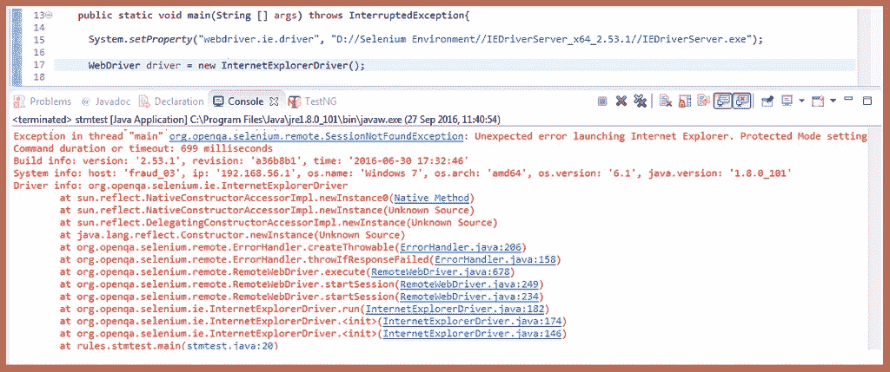

# 解决方案-无法使用 Selenium WebDriver 启动 IE 驱动程序

> 原文:[https://www . software testing material . com/failed-to-launch-ie-driver-using-selenium/](https://www.softwaretestingmaterial.com/failed-to-launch-ie-driver-using-selenium/)

## 使用 Selenium WebDriver 启动 IE 驱动失败？

我听很多 Selenium WebDriver 用户说，他们使用 Selenium WebDriver 启动 IE 驱动失败。以下是我们大多数人可能面临的常见问题的解决方案。

前面我们已经看到了“[如何在 Internet Explorer 浏览器](https://www.softwaretestingmaterial.com/selenium-webdriver-script-in-internet-explorer-browser/)中运行 Selenium WebDriver 脚本”。也许，我们可能无法使用 Selenium WebDriver 启动 IE 驱动程序。错误可能类似于我们放在下面的截图。

**错误 1:** 线程“main”org . open QA . selenium . remote . session not found 异常:启动 Internet Explorer 时出现意外错误。所有区域的保护模式设置并不相同。对于所有区域，启用保护模式必须设置为相同的值(启用或禁用)。(警告:服务器未提供任何堆栈跟踪信息)。

1.  打开**网络浏览器**
2.  进入**工具**菜单-**互联网选项**
3.  选择**安全**标签
4.  在**中选择一个区域以查看或更改安全设置**选择**互联网**并选中**启用保护模式**复选框(需要重启 Internet Explorer)。
5.  同样，对于另外三个如**本地内网**、**可信站点**、**受限站点**，选中**启用保护模式**(需要重启 ie 浏览器)复选框。

**错误 2 :** 线程“main”org . open QA . selenium . remote . session not found 异常:启动 Internet Explorer 时出现意外错误。浏览器缩放级别被设置为 200%。应该设置为 100%(警告:服务器没有提供任何堆栈跟踪信息)。

**解决方案:**要修复此错误，我们需要将 Internet Explorer 浏览器的缩放级别设置为 100%

按照以下步骤将缩放级别设置为 100%

1.  打开**网络浏览器**
2.  到**查看**–**缩放**–**选择 100%**

你想尝试在谷歌浏览器中运行 Selenium WebDriver 脚本吗？要运行快速启动，请单击下面的链接。

[如何在 Chrome 浏览器中运行 Selenium WebDriver 脚本](https://www.softwaretestingmaterial.com/selenium-webdriver-script-in-chrome-browser/)