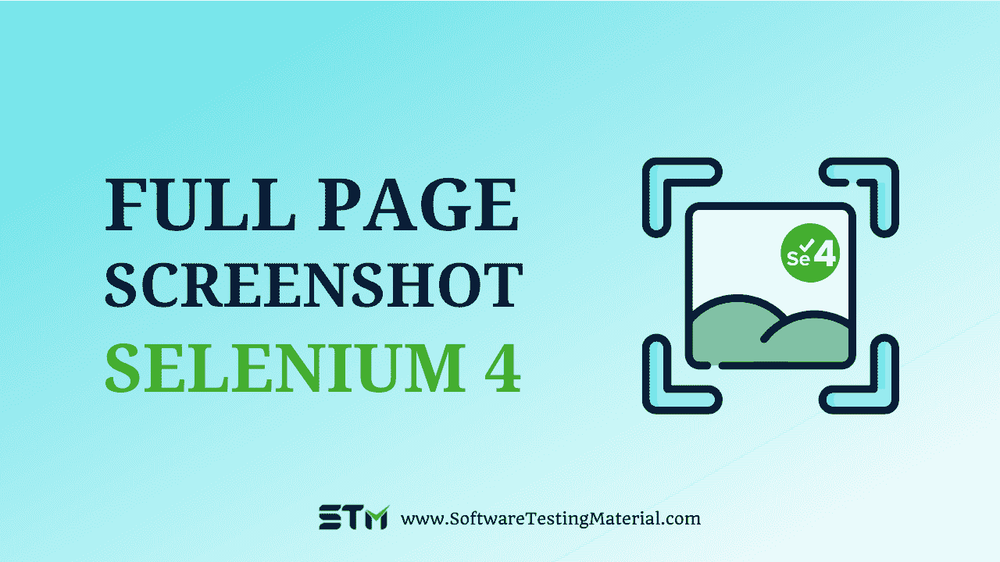

# Selenium 4 |如何使用 Selenium 4 捕获整页截图

> 原文:[https://www . software testing material . com/capture-screen-selenium-4/](https://www.softwaretestingmaterial.com/capture-screenshot-selenium-4/)

在本帖中，我们将看到 Selenium 4 的截图功能。使用 Selenium 3，我们可以捕获网页的屏幕截图。

为了在 Selenium 3 中捕获一个[整页截图，我们曾经使用过 **aShot WebDriver 截图实用程序**。](https://www.softwaretestingmaterial.com/how-to-capture-full-page-screenshot-using-selenium-webdriver/)

通过使用 Selenium WebDriver 4 的屏幕截图功能，我们可以在元素、部分和整页级别捕获屏幕截图。

> **不要错过:** [Selenium 4 中的新功能](https://www.softwaretestingmaterial.com/selenium-4/)

## **如何在 Selenium 4 中截图？**



如上所述，我们可以使用 Selenium 4 在元素级、节级和整页级进行截图。让我们来看看每一个细节和示例代码。

下面的代码可以让你对“**软件测试材料”**主页上的“ **STM 标志**进行截图。


```java
package stm.test;
import org.testng.annotations.BeforeClass;
import org.testng.annotations.AfterClass;
import org.testng.annotations.Test;
import org.openqa.selenium.By;
import org.openqa.selenium.JavascriptExecutor;
import org.openqa.selenium.OutputType;
import org.openqa.selenium.WebDriver;
import org.openqa.selenium.WebElement;
import org.openqa.selenium.firefox.FirefoxDriver;
import org.openqa.selenium.io.FileHandler;
import org.openqa.selenium.support.ui.ExpectedConditions;
import org.openqa.selenium.support.ui.WebDriverWait;
import io.github.bonigarcia.wdm.WebDriverManager;
import java.io.File;
import java.io.IOException;
import java.time.Duration;
public class ElementSectionScreenshot {
	public WebDriver driver;

	@BeforeClass
	public void setUp() {
		WebDriverManager.firefoxdriver().setup();
		driver = new FirefoxDriver();
		driver.manage().timeouts().implicitlyWait(Duration.ofSeconds(10));
		driver.get("https://www.softwaretestingmaterial.com");
	}

	@AfterClass
	public void afterClass() {
		driver.quit();
	}

        @Test
        public void captureWebElementScreenshot() {
                 WebElement elementLogo = driver.findElement(By.className("has-logo-image"));

                 File src = elementLogo.getScreenshotAs(OutputType.FILE);
                 File dest = new File(System.getProperty("user.dir") +    "/screenshots/elementLogo.png");

                 try {
		       FileHandler.copy(src, dest);
                 } catch (IOException exception) {
		       exception.printStackTrace();
                 }
         }
}
```

#### **#2。章节级截图**

在 STM 主页的右上角有一个菜单，如下所示。


以下代码允许您截取“**software testing material”**主页上的菜单截图。

```java
package stm.test;
import org.testng.annotations.BeforeClass;
import org.testng.annotations.AfterClass;
import org.testng.annotations.Test;
import org.openqa.selenium.By;
import org.openqa.selenium.JavascriptExecutor;
import org.openqa.selenium.OutputType;
import org.openqa.selenium.WebDriver;
import org.openqa.selenium.WebElement;
import org.openqa.selenium.firefox.FirefoxDriver;
import org.openqa.selenium.io.FileHandler;
import org.openqa.selenium.support.ui.ExpectedConditions;
import org.openqa.selenium.support.ui.WebDriverWait;
import io.github.bonigarcia.wdm.WebDriverManager;
import java.io.File;
import java.io.IOException;
import java.time.Duration;
public class ElementSectionScreenshot {
	public WebDriver driver;

	@BeforeClass
	public void setUp() {
		WebDriverManager.firefoxdriver().setup();
		driver = new FirefoxDriver();
		driver.manage().timeouts().implicitlyWait(Duration.ofSeconds(10));
		driver.get("https://www.softwaretestingmaterial.com");
	}

	@AfterClass
	public void afterClass() {
		driver.quit();
	}

        @Test
        public void captureSectionScreenshot() throws InterruptedException {

	         WebDriverWait wait = new WebDriverWait(driver, Duration.ofSeconds(10));
                 wait.until(ExpectedConditions.visibilityOfElementLocated(By.className("site-header-main-section-right")));

WebElement elementLogo = driver.findElement(By.className("site-header-main-section-right"));

                 File src = elementLogo.getScreenshotAs(OutputType.FILE);
                 File dest = new File(System.getProperty("user.dir") + "/screenshots/sectionTutorials.png");

                 try {
	                FileHandler.copy(src, dest);
                 } catch (IOException exception) {
	                exception.printStackTrace();
                 }
        }
}
```

#### **#3。整版截图**

我们来看看如何在 Selenium 中截图整页。

在 Selenium 4 中，有一个方法叫做*****getFullPageScreenshotAs**()***用于 Firefox **。**它允许我们截取整页的截图，并存储在指定的位置。

在这里，不是将其类型化为' **TakeScreenshot** '接口。我们必须将其类型转换为“ **FirefoxDriver** 实例。因为它只能在火狐浏览器上运行。

***src 文件=(((fire foxdriver)驱动程序)。getfullpagescreenshotas(output type)。文件(FILE)：***

以下代码允许您对“**software testing material”**主页进行整页截图。

```java
package stm.test;

import java.io.File;
import java.io.IOException;
import java.time.Duration;
import org.openqa.selenium.OutputType;
import org.openqa.selenium.WebDriver;
import org.openqa.selenium.firefox.FirefoxDriver;
import org.openqa.selenium.TakesScreenshot;
import org.openqa.selenium.io.FileHandler;
import org.testng.annotations.AfterClass;
import org.testng.annotations.BeforeClass;
import org.testng.annotations.Test;
import io.github.bonigarcia.wdm.WebDriverManager;

public class FullPageScreenshot {
	public WebDriver driver;

	@BeforeClass
	public void setUp() {
	     WebDriverManager.firefoxdriver().setup();
	     driver = new FirefoxDriver();
	     driver.manage().timeouts().implicitlyWait(Duration.ofSeconds(10));
	     driver.get("https://www.softwaretestingmaterial.com/category/tutorial/");
	}

	@AfterClass
	public void afterClass() {
	      driver.quit();
	}

	@Test
	public void captureFullPageScreenshot() throws IOException {
	     File src = ((FirefoxDriver)driver).getFullPageScreenshotAs(OutputType.FILE);
	     FileHandler.copy(src, new File("FullPageScreenshot.png"));
	}

	@Test
	public void capturePageScreenshot() throws IOException {
/*TakesScreenshot interface enables the Selenium WebDriver to take a screenshot and store it in different ways. "getScreenshotAs()" method captures the screenshot and store it in the specified location.*/
	     File src = ((TakesScreenshot) driver).getScreenshotAs(OutputType.FILE);
	     FileHandler.copy(src, new File("PageScreenshot.png"));
	}
}
```

上面的代码捕获了两个截图

1.  full page screen shot . png-完整页面撷取画面
2.  page screen shot . png-页面撷取画面

**1。FullPageScreenshot.png**——软件测试素材网站自上而下的全网页。


**2。PageScreenshot.png**–软件测试材料网站的唯一可见部分。


## **常见问题**

### **Selenium 截图功能和新的 Selenium 整页截图功能有什么区别？**

Selenium 屏幕截图功能捕获网页的可见部分。然而，Selenium 全页面截图功能可以捕捉整个网页。

### **哪里可以用整页截图？**

Selenium 4 中的整页截屏特性可以用于 bug 分析和报告。

## **结论**

这里我们看到了 Selenium 4 中新发布的整页截图功能。

***getScreenshotAs()***–这个 Selenium 4 方法允许我们捕获特定 WebElement 的屏幕截图。

*****getFullPageScreenshotAs**()***——Selenium 4 的这个方法可以让我们在 Firefox 中进行整页截图。

相关帖子:

*   [Selenium 4 简介&新功能](https://www.softwaretestingmaterial.com/selenium-4/)
*   [Selenium 4 教程](https://www.softwaretestingmaterial.com/selenium-tutorial/)
*   [Selenium 4 面试问题](https://www.softwaretestingmaterial.com/selenium-interview-questions/)