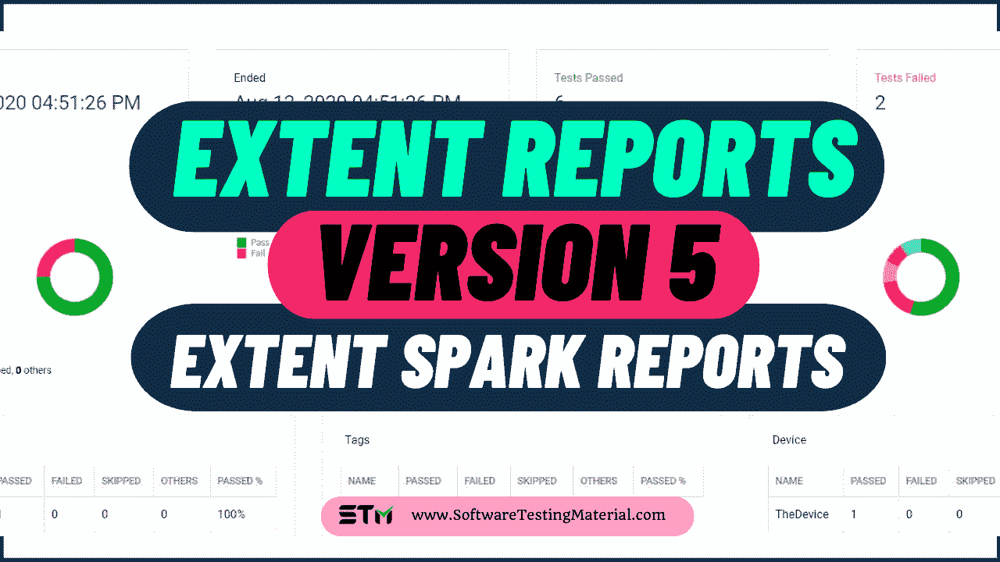

# 如何在 Selenium Webdriver 中生成范围报告[2022 更新]

> 原文:[https://www . software testing material . com/generate-extent-reports/](https://www.softwaretestingmaterial.com/generate-extent-reports/)

**在 Selenium WebDriver** **中生成范围报告的指南，即范围 Spark Reporter(范围报告版本 5)**

在本文中，我们看到了最流行和最广泛使用的 Selenium 报告工具之一(范围报告)。使用不同的 Selenium 报告工具可以看到 Selenium 结果。一些 Selenium WebDriver 报告工具如下。

*   [Selenium TestNG 报告生成](https://www.softwaretestingmaterial.com/testng-reports/)
*   Selenium JUnit 报告生成
*   Selenium 含量报告(最受欢迎的报告)




## **什么是范围报告？**

ExtentReports 是一个用于 selenium 测试自动化的开源报告库。范围报告成为 Selenium 自动化测试人员的首选，尽管 Selenium 附带了使用 JUnit 和 TestNG 等框架的内置报告。有了范围报告，您可以对自动化脚本的执行提供一个更广泛、更深入的视角。所以让我们看看为什么自动化测试人员更喜欢范围报告。


## **范围报告的优势**

范围报告的一些优点如下

ExtentTest 类用于记录先前生成的 HTML 报告的测试步骤。

以上两个类都可以与下面列出的常用内置方法一起使用。

*   startTest:用于执行测试用例的前提条件
*   endTest:用于执行测试用例的后置条件
*   Log:用于将每个测试步骤的状态记录到生成的 HTML 报告中。
*   刷新:用于清除相关报告中任何以前的数据，并创建一个全新的报告

测试状态可由以下值表示:

*   及格
*   失败
*   跳跃
*   信息

**语法**

```java
reports.endTest();
test.log(LogStatus.PASS,"Test Passed");
test.log(LogStatus.FAIL,"Test Failed");
test.log(LogStatus.SKIP,"Test Skipped");
test.log(LogStatus.INFO,"Test Info");
```

Log 方法接受两个参数，第一个是测试状态，第二个是打印到结果报告上的消息。

## **在 Selenium WebDriver 中生成范围报告**

本文的主要范围是显示范围报告。这是目前市场上最流行、使用最广泛的 Selenium 报告工具。

让我们看看如何在 Selenium WebDriver 中生成范围报告。

> [范围报告第 4 版-上一版【2020】](https://www.softwaretestingmaterial.com/extent-reports-selenium-version-4/)

### **生成范围报告的先决条件**

1.  **应该安装 Java**——[安装并设置 Java](https://youtu.be/FBtapPZIrjo)
2.  **应安装 TestNG**——[安装 TestNG](https://www.softwaretestingmaterial.com/install-testng-plugin/)
3.  **范围报告罐**–(版本 5.0.9)
4.  **extent-config . XML**–允许配置 HTML 报告

### **生成范围报告的步骤**

第一步:首先，在 eclipse 中创建一个 TestNG 项目

**步骤#2:** 下载 extent 库文件(Extent reports Version 5 JAR 文件——Extent Spark Reporter)并将下载的库文件添加到您的项目中

[Download Extent Reports Jars](https://mvnrepository.com/artifact/com.aventstack/extentreports)

如果您使用 pom.xml 文件，那么您可以在您的 maven 项目中添加范围报告 Maven 依赖项 5.0.9。

*<依赖>
<groupId>com . avent stack</groupId>
<artifactId>extent reports</artifactId>
<版本>5 . 0 . 9</版本>
</依赖>*

**步骤#3:** 创建一个 java 类，比如“ExtentReportsClass ”,并向其中添加以下代码

> [Selenium 与 Jenkins 持续集成【Maven–Git–Jenkins】](https://www.softwaretestingmaterial.com/selenium-continuous-integration/)

### 验证谷歌主页标题和标志的代码。

在程序本身的评论部分给出了清晰的解释。请浏览一遍，了解流程。

```java
package myExtentReport;
import java.io.File;
import java.io.IOException;
import java.text.SimpleDateFormat;
import java.util.Date;
import org.apache.commons.io.FileUtils;
import org.openqa.selenium.*;
import org.openqa.selenium.chrome.ChromeDriver;
import org.testng.Assert;
import org.testng.ITestResult;

import org.testng.SkipException;
import org.testng.annotations.*;
import com.aventstack.extentreports.ExtentReports;
import com.aventstack.extentreports.ExtentTest;
import com.aventstack.extentreports.Status;
import com.aventstack.extentreports.markuputils.ExtentColor;
import com.aventstack.extentreports.markuputils.MarkupHelper;
import com.aventstack.extentreports.reporter.ExtentSparkReporter;
import com.aventstack.extentreports.reporter.configuration.ChartLocation;
import com.aventstack.extentreports.reporter.configuration.Theme;
public class ExtentReportsClass {
public WebDriver driver;
public ExtentSparkReporter spark;
public ExtentReports extent;
public ExtentTest logger;

@BeforeTest
public void startReport() {
         // Create an object of Extent Reports
extent = new ExtentReports();

spark = new ExtentSparkReporter(System.getProperty("user.dir") + "/test-output/STMExtentReport.html");
extent.attachReporter(spark);
extent.setSystemInfo("Host Name", "SoftwareTestingMaterial");
         extent.setSystemInfo("Environment", "Production");
extent.setSystemInfo("User Name", "Rajkumar SM");
spark.config().setDocumentTitle("Title of the Report Comes here ");
                // Name of the report
spark.config().setReportName("Name of the Report Comes here ");
                // Dark Theme
spark.config().setTheme(Theme.STANDARD);
}
//This method is to capture the screenshot and return the path of the screenshot.
public static String getScreenShot(WebDriver driver, String screenshotName) throws IOException {
String dateName = new SimpleDateFormat("yyyyMMddhhmmss").format(new Date());
TakesScreenshot ts = (TakesScreenshot) driver;
File source = ts.getScreenshotAs(OutputType.FILE);
// after execution, you could see a folder "FailedTestsScreenshots" under src folder
String destination = System.getProperty("user.dir") + "/Screenshots/" + screenshotName + dateName + ".png";
File finalDestination = new File(destination);
FileUtils.copyFile(source, finalDestination);
return destination;
}

@BeforeMethod
public void setup() {
System.setProperty("webdriver.chrome.driver","C://AutomationFramework//Drivers//chromedriver.exe");
driver = new ChromeDriver();
driver.manage().window().maximize();
driver.get("https://www.google.com/");
}
@Test
public void verifyTitle() {
logger = extent.createTest("To verify Google Title");
Assert.assertEquals(driver.getTitle(),"Google");
}
@Test
public void verifyLogo() {
logger = extent.createTest("To verify Google Logo");
boolean img = driver.findElement(By.xpath("//img&#91;@id='hplogo']")).isDisplayed();
logger.createNode("Image is Present");
Assert.assertTrue(img);
logger.createNode("Image is not Present");
Assert.assertFalse(img);
}
@AfterMethod
public void getResult(ITestResult result) throws Exception{
if(result.getStatus() == ITestResult.FAILURE){
//MarkupHelper is used to display the output in different colors
logger.log(Status.FAIL, MarkupHelper.createLabel(result.getName() + " - Test Case Failed", ExtentColor.RED));
logger.log(Status.FAIL, MarkupHelper.createLabel(result.getThrowable() + " - Test Case Failed", ExtentColor.RED));
//To capture screenshot path and store the path of the screenshot in the string "screenshotPath"
//We do pass the path captured by this method in to the extent reports using "logger.addScreenCapture" method.
//String Scrnshot=TakeScreenshot.captuerScreenshot(driver,"TestCaseFailed");
String screenshotPath = getScreenShot(driver, result.getName());
//To add it in the extent report
logger.fail("Test Case Failed Snapshot is below " + logger.addScreenCaptureFromPath(screenshotPath));
}
else if(result.getStatus() == ITestResult.SKIP){
logger.log(Status.SKIP, MarkupHelper.createLabel(result.getName() + " - Test Case Skipped", ExtentColor.ORANGE));
}
else if(result.getStatus() == ITestResult.SUCCESS)
{
logger.log(Status.PASS, MarkupHelper.createLabel(result.getName()+" Test Case PASSED", ExtentColor.GREEN));
}
driver.quit();
}

@AfterTest
public void endReport() {
extent.flush();
}
}
```

**extent-config.xml:**

```java
<?xml version="1.0" encoding="UTF-8"?>
<extentreports>
  <configuration>
    <!-- report theme -->
    <!-- standard, dark -->
    <theme>standard</theme>

    <!-- document encoding -->
    <!-- defaults to UTF-8 -->
    <encoding>UTF-8</encoding>

    <!-- protocol for script and stylesheets -->
    <!-- defaults to https -->
    <protocol>https</protocol>

    <!-- title of the document -->
    <documentTitle>ExtentReports 2.0</documentTitle>

    <!-- report name - displayed at top-nav -->
    <reportName></reportName>

    <!-- report headline - displayed at top-nav, after reportHeadline -->
    <reportHeadline>Automation Report</reportHeadline>

    <!-- global date format override -->
    <!-- defaults to yyyy-MM-dd -->
    <dateFormat>yyyy-MM-dd</dateFormat>

    <!-- global time format override -->
    <!-- defaults to HH:mm:ss -->
    <timeFormat>HH:mm:ss</timeFormat>

    <!-- custom javascript -->
    <scripts>
      <![CDATA[
        $(document).ready(function() {

        });
      ]]>
    </scripts>

    <!-- custom styles -->
    <styles>
      <![CDATA[

      ]]>
    </styles>
  </configuration>
</extentreports>
```

通过使用这个外部 XML 文件(extent-config.xml ),我们可以更改报告主题(standard 或 dark)、报告标题、文档标题等细节。,

**控制台输出:**

= = = = = = = = = = = = = = = = = = = = = = = = = = = = = = = = = = = = =
默认套件
总测试运行:2、失败:1、跳过:0 ========================

执行上述 ExtentReportsClass.java 文件后刷新项目。你可以在你的测试输出文件夹中找到一个名为“***【STMExtentReport.html】***”的 HTML 文件。复制 STMExtentReport.html 文件的位置**并用任何浏览器打开它。你可以看到漂亮的 HTML 报告，如下所示。**

### **代码解释**

一、导入了两个类 ***ExtentReports*** 和 ***ExtentTest*** 。

***ExtentReports* :** 通过使用这个类，我们可以设置需要生成报告的路径。

通过使用这个类，我们可以在报告中生成日志。

二。采用了两种带有 **@Test** 标注的方法如 ***verifyTitle*** ， ***VerifyLogo*** 。另一个方法 ***startReport*** 带 **@BeforeTest** 标注，另一个方法 ***endReport*** 带 **@AfterTest** 标注，另一个方法 ***getResult*** 带 **@AfterMethod** 标注，另一个方法 ***setup*** 带 **@BeforeMethod** 标注

在这里，我的目的是生成一个包含所有三种结果的报告，比如通过和失败。

> [在范围报告](https://www.softwaretestingmaterial.com/screenshots-extent-reports/)中添加**失败测试案例**的截图

三。使用了分配给@BeforeTest 批注的 *startReport* 方法中的 ***ExtentReports*** 类的对象(即 *extent* )来生成所需路径的 HTML 报表

四。其余方法中使用了 ***ExtentTest*** 类的对象(即 *logger* )来写日志报告。

动词 （verb 的缩写）使用了@AfterMethod 中的 ***ITestResult*** 类来描述一个测试的结果。

### **范围火花报告|带饼图的图形报告(示例报告)**

#### **测试用例**


#### **异常情况**


#### **标签**


#### **装置**


#### **作者**


#### **图形报告**


***图片来源:***

查看下面的视频，查看“**范围报告完整指南**

[https://www.youtube.com/embed/OmjNht903y0?rel=0](https://www.youtube.com/embed/OmjNht903y0?rel=0)

如果你喜欢这个视频，那么请订阅我们的 [YouTube 频道](https://www.youtube.com/c/SoftwareTestingMaterialWebsite?sub_confirmation=1)以获得更多视频教程。

## **结束**

生成报告是任何自动化框架的关键部分。报告可以让您了解自动化测试的健康状况，并且可以帮助您识别需要改进的地方。

生成报告有许多不同的选项，但最流行的一种是使用范围报告。

Extent reports 是一个开源库，可以生成可定制的 HTML 报告。所以生成测试报告并与组织中的利益相关者共享就成了 Selenium 自动化测试人员的最佳选择。

除了概述所有已执行的测试，范围报告还提供了饼图，直观地总结了测试脚本。

> [测试自动化框架面试问题](https://www.softwaretestingmaterial.com/test-automation-framework-interview-questions/)

如果你不是 SoftwareTestingMaterial.com 的定期读者，那么我强烈推荐你使用下面的表格注册免费的电子邮件时事通讯。

## **常见问题**

**Can we customize extent reports?**

是的，我们可以自定义范围报告，如更改标题、更改为深色主题、添加截图、包含徽标等

**How to change title in the extent reports?**

打开您的文件“extent-config.xml ”,并将以下代码添加到其中。

修改**【文档标题】**打开和关闭标签之间的浏览器标题。

修改**【报告名称】**开始和结束标签之间的报告标题。

**How to change the theme to dark theme?**

打开 XML 文件，在配置节点下添加以下代码。

将主题修改为**【黑暗】**在**【主题】**打开和关闭标签之间。

**How to resolve HTTPS protocol error in extent reports?**

有时由于组织中的网络限制，样式表和脚本文件的 **HTTPS** 协议被阻止。

在这种情况下，我们可以在您的 **XML** 文件的配置节点下添加以下代码，以确保所有的脚本和样式表都遵循 HTTP 协议

在**【协议】**开始和结束标记之间将文本修改为“ **http** ”。
T13】

**What is the use of extent reports?**

Extent Reports 是一个易于使用的库，允许用户创建自定义报告，无论它们是关于测试运行还是其他项目。

**Is extent report part of TestNG?**

范围报告是基于 HTML 的可定制报告，使用 TestNG 框架与 Selenium 一起提供。它不仅允许客户创建大量数据驱动的报告，还可以生成能够处理复杂操作并做出果断决策的文档和 XML 提要。