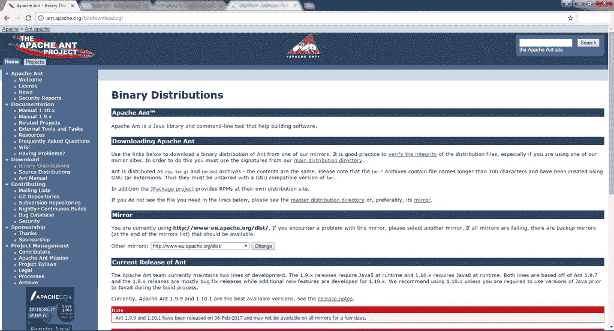
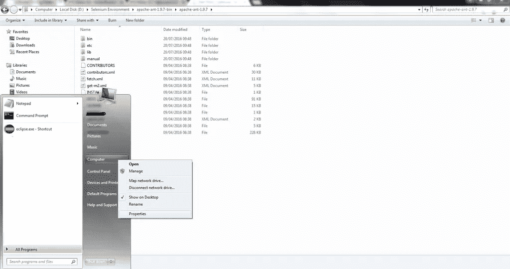
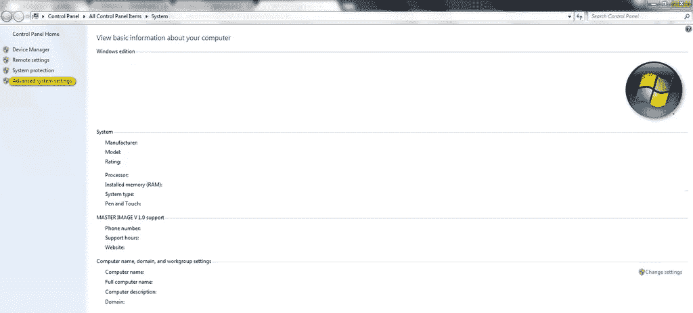
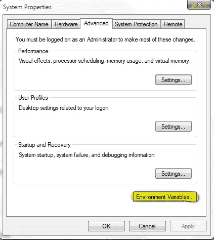
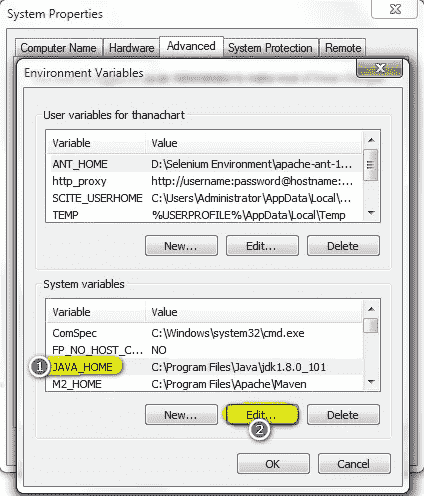
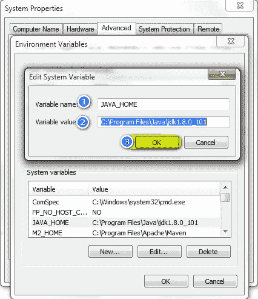
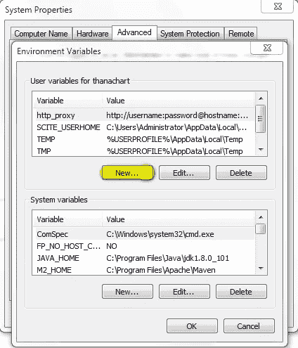
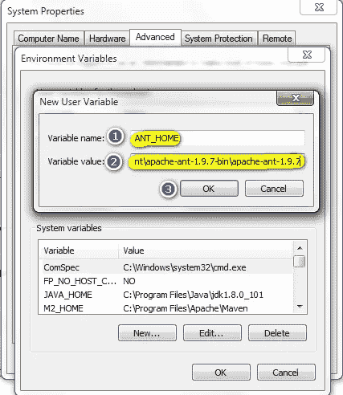
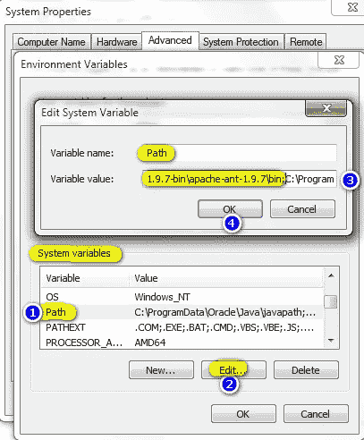
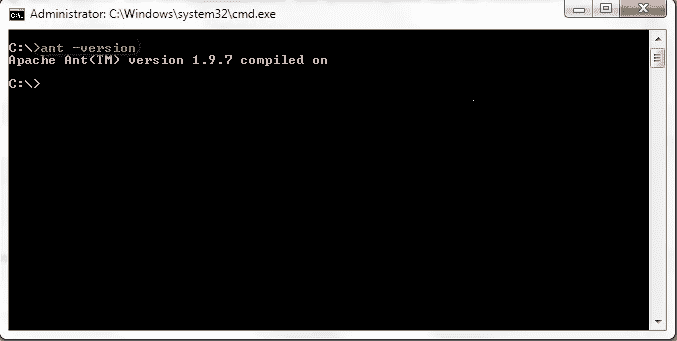

# 如何下载和安装 Apache ANT |软件测试材料

> 原文:[https://www.softwaretestingmaterial.com/install-apache-ant/](https://www.softwaretestingmaterial.com/install-apache-ant/)

## 分步过程—安装 Apache Ant:

安装 Apache Ant——Apache Ant 是一个 Java 库和命令行工具，可以帮助构建软件。

**第一步:**转到这个网址——【http://ant.apache.org/bindownload.cgi T2】

**第二步:**下载名为 apache-ant-1.10.1-bin.zip 的 zip 文件

**第 4 步:**转到计算机-属性-高级系统设置

第五步:一个新窗口打开。单击环境变量

**第六步:**确保 JAVA_HOME 配置为 Windows 环境变量。

如果没有设置，单击“新建…”按钮，将变量名设置为“JAVA_HOME”，变量值设置为 JDK 的根路径。

**第七步:**点击‘新建…’按钮，将变量名设置为‘ANT _ HOME’，变量值设置为解压文件夹的根路径，点击确定。

**第 8 步:**从列表中选择“路径”变量，点击“编辑”，将 ANT 路径添加到 bin 文件夹中

**步骤 9:** 重新启动系统一次，现在就可以使用 Ant 构建工具了。

**步骤 10:** 使用命令行检查您的 Ant 版本:打开命令提示符并键入' *ant -version* ，如下所示。

系统应该找到命令 ant 并显示您安装的 ant 的版本号。

如果你不是我博客的经常读者，那么我强烈推荐你使用下面的链接注册免费的电子邮件时事通讯。